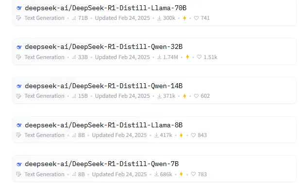

# LLM 蒸馏技术

> by @Laizhuocheng

---

## 一、简介

LLM 蒸馏 (Distillation) 是一种技术，用于将大型语言模型 (LLM) 的知识转移到较小的模型中。其主要目的是在保持模型性能的同时，减少模型的大小和计算资源需求。通过蒸馏技术，较小的模型可以在推理时更高效地运行，适用于资源受限的环境。

**说人话就是：** 想象一位武林高手，练了几十年功夫，内力深厚。现在他要把毕生武学传给徒弟，但徒弟不可能也花几十年从头练起。于是师父把自己的心得、诀窍、判断方式浓缩教给徒弟。徒弟虽然内力不如师父深厚，但能用更短的时间、更少的资源，学到师父大部分的实战能力。这就是"蒸馏"——把大模型的"智慧"提炼到小模型里。


---

## 二、蒸馏过程

蒸馏过程通常包括以下几个步骤：

1. **训练教师模型**：首先训练一个大型且性能优越的教师模型。
2. **生成软标签**：使用教师模型对训练数据进行预测，生成软目标 (soft targets)，这些目标包含了教师模型的概率分布信息。
3. **训练学生模型**：使用软目标 (soft targets) 和原始训练数据 (hard targets) 来训练较小的学生模型，使其能够模仿教师模型的行为。

这种方法不仅可以提高模型的效率，还可以在某些情况下提高模型的泛化能力。

### Hard Targets（硬标签）

硬标签就是传统的"标准答案"，通常是 one-hot 编码，只告诉你正确答案是什么：

```
这张图是猫：[1, 0, 0]
             猫  狗  老虎
```

### Soft Targets（软标签）

软标签是教师模型输出的完整概率分布：

```
教师模型的判断：[0.70, 0.25, 0.05]
                 猫    狗    老虎
```

这里包含了丰富得多的信息：教师认为这张图 70% 可能是猫，但也有 25% 可能是狗（也许图片里的猫长得有点像狗），几乎不可能是老虎。

---

## 三、蒸馏可能存在的问题

- **信息丢失**：由于学生模型比教师模型小，可能无法完全捕捉教师模型的所有知识和细节，导致信息丢失。
- **依赖教师模型**：学生模型的性能高度依赖于教师模型的质量，如果教师模型本身存在偏差或错误，学生模型可能会继承这些问题。
- **适用性限制**：蒸馏技术可能不适用于所有类型的模型或任务，尤其是那些需要高精度和复杂推理的任务。

---

## 四、典型例子

- **GPT-4o (教师模型)** 中提炼出 **GPT-4o-mini (学生模型)**
- **DeepSeek-R1 (教师模型)** 中提炼出 **DeepSeek-R1-Distill-Qwen-32B (学生模型)**（这个不是传统意义上的蒸馏了，是蒸馏 + 数据增强 + 微调）

---

## 五、其他蒸馏技术

### 1. 基于 Logits 的蒸馏（Logit-based Distillation）

这是最经典的方法。学生模型学习教师模型输出层的概率分布（软标签），而不仅仅是最终答案。软标签中包含了教师模型对各个 token 的置信度，这种"不确定性"本身就是有价值的知识。

| 优点 | 缺点 |
|------|------|
| 实现简单，理论成熟 | 只利用了输出层信息 |
| 软标签包含丰富的"暗知识" | 需要访问教师模型的 logits |
| 训练稳定 | 对长序列生成效果有限 |

### 2. 基于特征的蒸馏（Feature-based Distillation）

让学生模型模仿教师模型中间层的隐藏状态（hidden states）或注意力分布（attention maps），学习其内部的特征表示方式。

| 优点 | 缺点 |
|------|------|
| 知识转移更深入 | 需要师生模型架构对齐 |
| 学生能学到更丰富的表征 | 实现复杂度较高 |
| 对下游任务泛化更好 | 计算成本更高 |

### 3. 为什么 Soft Targets 更有价值

**1. 包含类别间的相似性信息**

硬标签只说"这是猫"，但软标签还告诉你"猫和狗比猫和老虎更像"。这种类别之间的关系是宝贵的"暗知识"（dark knowledge），是教师模型从海量数据中学到的。

**2. 提供更平滑的学习信号**

想象你教一个孩子认动物。如果孩子把一只橘猫认成了小老虎，硬标签只会说"错了"，但软标签会说"嗯，确实有点像，但更可能是猫"。这种反馈更有建设性。