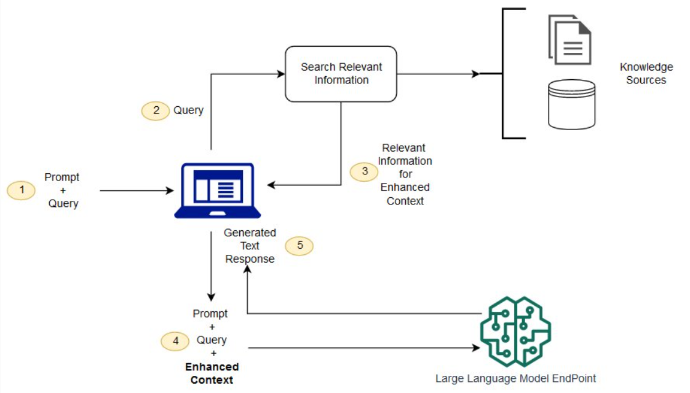

# RAG 技术科普

## 一、什么是 RAG？

RAG 是一种将"信息检索"与"大语言模型生成"相结合的技术架构。简单来说，它让 AI 在回答问题之前，先去查阅相关资料，然后基于查到的内容来生成答案。你可以把它想象成一个**"开卷考试"**的机制——模型不再仅凭自己记住的知识作答，而是可以临时翻阅参考资料。

---

## 二、为什么需要 RAG？

大语言模型虽然强大，但有几个天然的局限性：

- **知识的时效性问题**：模型的训练数据有截止日期，无法知道最新发生的事情
- **"幻觉"问题**：模型有时会一本正经地编造不存在的信息
- **专业领域的深度不足**：通用模型很难掌握某个企业或机构的内部知识

RAG 正是为了解决这些问题而生的。通过外挂一个可更新的知识库，模型就能获取最新、最准确、最专业的信息。

---

## 三、RAG 如何工作？

RAG 的工作流程可以分为三个核心步骤。典型 RAG 系统包含三个关键阶段：

- **检索阶段（Retrieval）**：根据输入问题从外部知识库（如维基百科、专业文档等）检索相关文档片段
- **增强阶段（Augmentation）**：将检索到的相关文本与原始问题拼接，形成增强后的输入（即 prompt）
- **生成阶段（Generation）**：语言模型基于增强后的上下文生成最终回答

这种机制使模型能够突破训练数据的限制，实时获取最新知识。

---

## 四、RAG 的典型应用场景

RAG 技术目前被广泛应用于多个领域：

- **企业内部知识库问答**：员工可以用自然语言查询公司的规章制度、产品手册、技术文档等
- **智能客服系统**：让机器人能够准确回答产品相关的问题
- **专业领域 AI 助手**：法律、医疗、金融等领域借助 RAG 来确保回答的准确性和可追溯性

---

## 五、RAG 的优势与挑战

### 优势

| 优势 | 说明 |
|------|------|
| 提升事实准确性 | 通过检索真实数据减少模型"幻觉" |
| 动态知识更新 | 无需重新训练即可更新知识库 |
| 领域适应性强 | 通过替换知识库快速适配不同专业领域 |
| 可解释性增强 | 可追溯答案的参考来源 |

### 挑战

| 挑战 | 说明 |
|------|------|
| 检索质量依赖 | 检索结果的质量直接影响最终生成效果 |
| 延迟增加 | 检索步骤会引入额外的计算和 IO 开销 |
| 知识更新成本 | 需要维护高质量且及时更新的知识库 |
| 上下文长度限制 | 检索内容可能超出模型上下文窗口 |