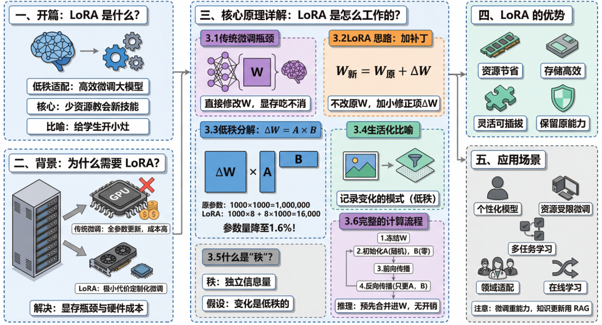
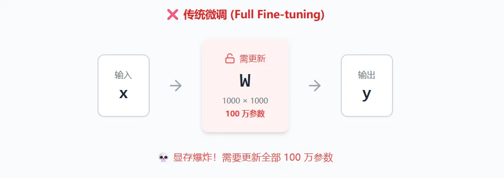
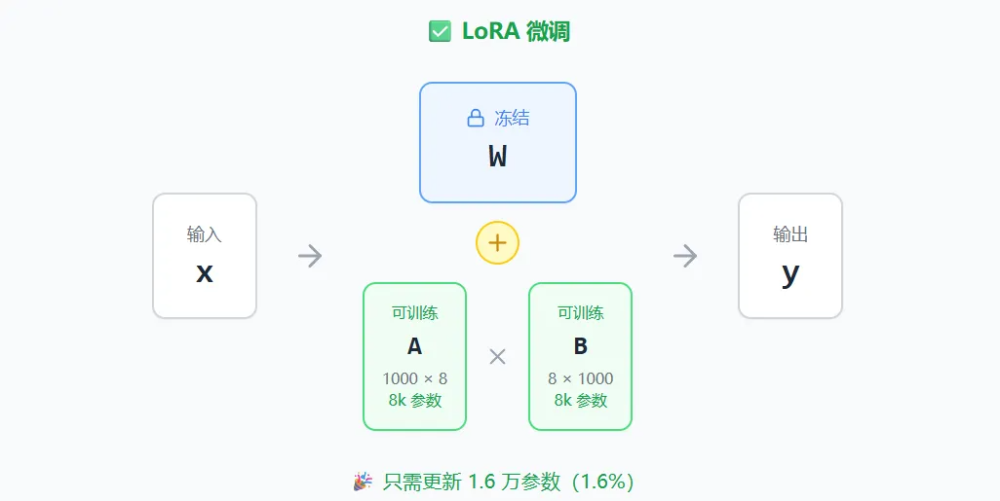

# LoRA 科普：用极小代价微调大模型

## 一、开篇：LoRA 是什么？

**LoRA** 全称是 **Low-Rank Adaptation**（低秩适配），是一种用于微调大型预训练模型的技术。简单来说，它是一种让你用很少的资源和数据，就能"教会"大模型新技能或新风格的方法。你可以把它理解为给一个已经很聪明的学生"开小灶"，而不是让他从头学起。

---

## 二、背景：为什么需要 LoRA？

传统的模型微调（Fine-tuning）需要更新模型的全部参数。对于动辄数十亿参数的大模型，这意味着巨大的显存占用、漫长的训练时间、以及高昂的硬件成本。普通用户几乎不可能在消费级显卡上完成这件事。

LoRA 的出现就是为了解决这个问题——**用极小的代价实现定制化微调**。

---

## 三、核心原理详解：LoRA 是怎么工作的？

### 3.1 从传统微调说起

神经网络的本质就是一堆矩阵运算。一个大模型里有很多层，每一层都有一个权重矩阵 $W$，它决定了这一层"怎么处理信息"。

传统微调的做法是：在新数据上训练时，直接修改这些 $W$。问题是，一个大模型可能有几百个这样的矩阵，每个矩阵可能有上千万甚至上亿个参数。全部更新一遍，显存根本吃不消。

### 3.2 LoRA 的核心思路：不改原来的，加个"补丁"

LoRA 的想法很巧妙：我不动原来的权重 $W$，我在旁边加一个小小的"修正项" $\Delta W$。

最终这一层的输出变成：

$$
W_{新} = W_{原} + \Delta W
$$

关键问题来了：这个 $\Delta W$ 怎么设计，才能既有效果，又足够小？

### 3.3 低秩分解：把大矩阵拆成两个小矩阵

LoRA 的核心技巧叫**低秩分解**。它不直接存储 $\Delta W$，而是把它拆成两个小矩阵相乘：

$$
\Delta W = A \times B
$$

举个具体的例子。假设原始权重 $W$ 是一个 $1000 \times 1000$ 的矩阵，那它有 100 万个参数。

如果我们设秩 $r = 8$（这是 LoRA 中一个可调的超参数），那么：

- 矩阵 $A$ 的尺寸是 $1000 \times 8$，有 8000 个参数
- 矩阵 $B$ 的尺寸是 $8 \times 1000$，有 8000 个参数
- $A \times B$ 相乘后，结果仍然是 $1000 \times 1000$，可以和原来的 $W$ 直接相加

**参数量对比：**

$$
\text{原本需要训练：} 1000 \times 1000 = 1,000,000
$$

$$
\text{LoRA 只需训练：} 1000 \times 8 + 8 \times 1000 = 16,000
$$

参数量直接降到原来的 **1.6%**！

### 3.4 一个生活化的比喻

想象你有一张 1000×1000 像素的照片（100 万个像素点）。如果你想"记住"这张照片的变化，传统方法是记录每一个像素点怎么变——这需要存 100 万个数字。

但如果这张照片的变化其实很简单（比如只是整体变亮了一点，或者加了一层滤镜），你其实不需要 100 万个数字来描述它。你只需要记录"变化的模式"，这可能只需要几千个数字就够了。

LoRA 就是基于这个直觉：**模型在学习新任务时，参数的变化往往是有规律、有结构的，可以用一个"低秩"的方式来紧凑地表示。**

### 3.5 什么是"秩"？

"秩"（Rank）是线性代数中的概念，你可以简单理解为：**一个矩阵里真正独立的、不重复的信息有多少。**

秩越低，说明矩阵里的信息冗余越多，可以用更少的数据来表示。LoRA 的假设就是：微调时的参数变化 $\Delta W$ 是一个低秩矩阵，不需要那么多独立参数来描述。

实验表明，秩 $r$ 取 4、8、16 这样的小数字，通常就能达到很好的效果。

### 3.6 完整的计算流程

**训练时的流程是这样的：**

1. 冻结原始权重 $W$，不更新它
2. 初始化两个小矩阵 $A$ 和 $B$（$A$ 通常用随机初始化，$B$ 初始化为零）
3. 前向传播时，计算 $W \cdot x + A \cdot B \cdot x$
4. 反向传播时，只更新 $A$ 和 $B$

**推理时**，可以把 $A \times B$ 预先算好合并进 $W$，所以**推理速度和原模型完全一样**，没有额外开销。

---

## 四、LoRA 的优势

LoRA 最显著的优势体现在几个方面：

- **资源节省**：训练只需要几 GB 显存，普通显卡就能跑
- **存储高效**：一个 LoRA 文件通常只有几十 MB，而完整模型可能几十 GB
- **灵活可插拔**：可以为同一个基础模型训练多个 LoRA，按需加载，实现不同风格或功能的快速切换
- **能力保留**：原始模型的能力得以保留，因为主体参数没有被改动

---

## 五、应用场景

- **个性化模型**：为特定领域或任务快速创建专门的模型变体
- **资源受限环境**：在计算资源有限的环境中实现大型模型的微调
- **多任务学习**：为不同任务维护单独的 LoRA 适配器，而不是完整的模型副本
- **参数高效迁移学习**：将通用模型快速适配到专业领域（如医疗、法律、金融等）
- **在线学习**：持续更新模型以适应新数据，而不需要重新训练完整模型

> ⚠️ **注意**：微调更应针对模型**能力**上的更新，而不是**知识**上的更新。知识上的更新应该交给 RAG 来完成。