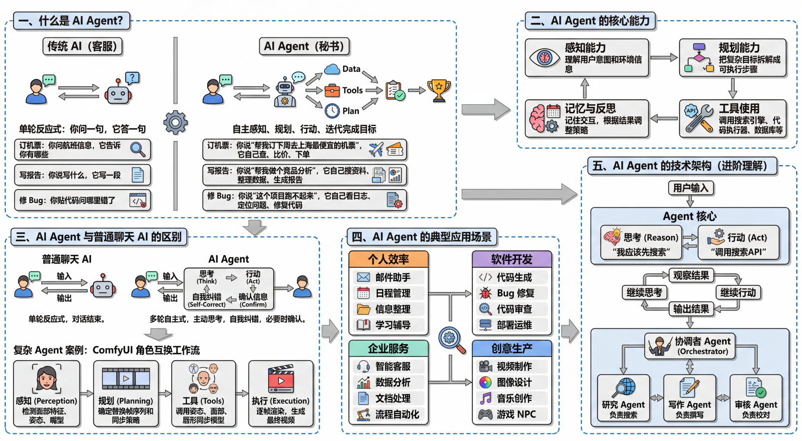
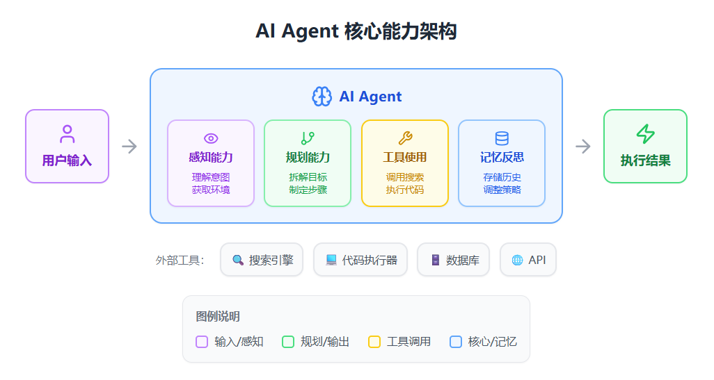

# AI Agent 学习笔记

---

## 一、什么是 AI Agent？

AI Agent（智能体）是一种能够**自主感知环境、制定计划、并采取行动**来完成目标的人工智能系统。与传统的 AI 工具不同，它不只是"你问一句，它答一句"，而是能像一个有主动性的助手，自己拆解任务、调用工具、不断迭代直到完成目标。

### 生活化类比

| 场景 | 传统 AI（客服） | AI Agent（秘书） |
|------|----------------|-----------------|
| 订机票 | 你问航班信息，它告诉你有哪些 | 你说"帮我订下周去上海最便宜的机票"，它自己查、比价、下单 |
| 写报告 | 你说写什么，它写一段 | 你说"帮我做个竞品分析"，它自己搜资料、整理数据、生成报告 |
| 修 Bug | 你贴代码问哪里错了 | 你说"这个项目跑不起来"，它自己看日志、定位问题、修复代码 |

---

## 二、AI Agent 的核心能力

AI Agent 通常具备几个关键能力：

- **感知能力**：能理解用户的意图和当前环境信息
- **规划能力**：能把一个复杂目标拆解成多个可执行的步骤
- **工具使用能力**：能调用搜索引擎、代码执行器、数据库等外部工具
- **记忆与反思能力**：能记住之前的交互，并根据结果调整策略
  
---

## 三、AI Agent 与普通聊天 AI 的区别

普通的聊天 AI（如早期的 ChatGPT）是"单轮反应式"的——你输入，它输出，对话结束。而 AI Agent 是"多轮自主式"的，它会主动思考下一步该做什么，遇到问题会自我纠错，必要时还会向用户确认信息。

> 简单来说，聊天 AI 是工具，AI Agent 是能使用工具的"数字员工"。

### 复杂 Agent 案例：ComfyUI 角色互换工作流

用户提到的 ComfyUI 例子是一个很好的"多能力协同"案例：

**这个 Agent 做了什么：**

- **感知**：检测源视频中人物的面部特征、姿态、嘴型
- **规划**：确定需要替换的帧序列和同步策略
- **工具**：调用姿态追踪模型、面部检测模型、唇形同步模型
- **执行**：逐帧渲染，生成最终视频

这说明 AI Agent 不仅能处理文本任务，还能编排复杂的多媒体工作流。

---

## 四、AI Agent 的典型应用场景

| 个人效率 | 软件开发 | 企业服务 | 创意生产 |
|---------|---------|---------|---------|
| 邮件助手 | 代码生成 | 智能客服 | 视频制作 |
| 日程管理 | Bug 修复 | 数据分析 | 图像设计 |
| 信息整理 | 代码审查 | 文档处理 | 音乐创作 |
| 学习辅导 | 部署运维 | 流程自动化 | 游戏 NPC |

---

## 五、AI Agent 的技术架构（进阶理解）

### 经典架构：ReAct（Reason + Act）

ReAct 是一种让 Agent 交替进行"思考"和"行动"的架构模式。其执行流程如下：

**用户输入** → **Agent 核心处理** → **输出结果**

在 Agent 核心中，包含两个交替运行的模块：

| 模块 | 功能 | 示例输出 |
|------|------|---------|
| 思考（Reason） | 分析当前状态，决定下一步策略 | "我应该先搜索相关资料" |
| 行动（Act） | 执行具体操作，调用外部工具 | "调用搜索 API 获取结果" |

整体循环为：**观察结果 → 继续思考 → 继续行动 → ... → 输出结果**

### 多 Agent 协作架构

复杂任务可以由多个专业化的 Agent 分工协作完成，由一个协调者统一调度：

| 角色 | 职责 |
|------|------|
| 协调者 Agent（Orchestrator） | 接收任务，分配子任务，整合最终结果 |
| 研究 Agent | 负责信息搜索和资料收集 |
| 写作 Agent | 负责内容撰写和文案生成 |
| 审核 Agent | 负责内容校对和质量把控 |

协调者将任务拆解后分发给各个子 Agent，各子 Agent 完成后将结果返回协调者进行整合输出。