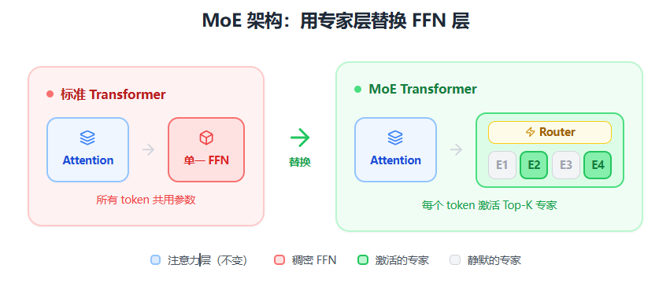

# MoE 模型科普文章

## 一、开篇：从一个问题说起

想象一家医院，如果只有一位"全科医生"处理所有病人，效率会很低；但如果有内科、外科、眼科等多位专科医生，每个病人根据症状被分配给最合适的专家，效率和质量都会大幅提升。

**MoE（Mixture of Experts，混合专家）** 模型的核心思想与此类似：与其让一个巨大的神经网络处理所有任务，不如训练多个"专家"网络，再用一个"调度员"来决定每个输入该由哪些专家处理。

---

## 二、MoE 的核心组件

这部分会解释两个关键角色。

### 专家网络（Experts）

是一组结构相同但参数不同的子网络，每个专家在训练过程中会逐渐"专精"于处理某类输入模式。比如在语言模型中，有的专家可能擅长处理数学推理，有的擅长处理日常对话。

### 门控网络（Gating Network / Router）

是整个系统的调度员。它接收输入，输出一个概率分布，决定这个输入应该交给哪些专家处理，以及每个专家的贡献权重是多少。最常见的设计是 **Top-K 门控**，即只激活得分最高的 K 个专家（通常 K=1 或 K=2），其余专家保持静默。

### 算法流程

假设我们有一个 MoE 层，包含 N 个专家（比如 N=8），设定 K=2（即每次激活 2 个专家）。当一个输入向量 $x$ 进入这一层时，处理过程如下：

#### 第一步：计算亲和度分数

门控网络本质上是一个简单的线性变换。它将输入 $x$ 映射为一个 N 维向量，每个维度代表对应专家的"匹配分数"：

$$
s = W_{g} \cdot x
$$

这里 $W_{g}$ 是门控网络的可学习参数矩阵。假设算出来 $s = [1.2, 3.5, 0.8, 2.1, -0.5, 4.2, 1.0, 0.3]$，这意味着第 6 号专家（得分 4.2）和第 2 号专家（得分 3.5）与当前输入最匹配。

#### 第二步：选出 Top-K 专家

对分数向量 $s$ 排序，保留得分最高的 K 个，其余位置设为负无穷（或直接忽略）。在上面的例子中，Top-2 是专家 6 和专家 2。

#### 第三步：归一化权重

只对被选中的 K 个专家的分数做 Softmax，得到归一化的权重。假设专家 6 的分数是 4.2，专家 2 的分数是 3.5：

$$
G_{6} = \frac{e^{4.2}}{e^{4.2} + e^{3.5}} \approx 0.67
$$

$$
G_{2} = \frac{e^{3.5}}{e^{4.2} + e^{3.5}} \approx 0.33
$$

注意这里只在被选中的专家之间做归一化，未被选中的专家权重直接为 0。

#### 第四步：计算加权输出

将输入 $x$ 分别送入被选中的专家网络，得到各自的输出，然后按权重加权求和：

$$
y = 0.67 \cdot E_{6}(x) + 0.33 \cdot E_{2}(x)
$$

其余 6 个专家完全不参与计算，节省了大量算力。

---

## 三、为什么需要 MoE？

传统的 **Dense（稠密）模型** 有一个尴尬的现实：模型能力往往与参数量成正比，但参数量又与计算成本成正比。想要更聪明的模型，就必须付出更多的算力代价。

MoE 提供了一条"鱼和熊掌兼得"的路径。通过 **稀疏激活（Sparse Activation）**，一个拥有数千亿参数的 MoE 模型，在推理时可能只激活其中一小部分参数。这意味着你可以拥有一个"名义上"很大的模型（总参数量大），但"实际上"运行成本相对较低（激活参数量小）。

---

## 四、MoE 是如何工作的？

当一个输入（比如一个 token）进入 MoE 层时，首先由门控网络计算该输入对所有专家的"亲和度"分数。接着，系统选出得分最高的 K 个专家，将输入分别送入这些专家进行计算。最后，将各专家的输出按门控权重加权求和，得到该 MoE 层的最终输出。

整个过程可以用公式表示为：

$$
y = \sum_{i \in \text{Top-K}} G(x)_{i} \cdot E_{i}(x)
$$

其中 $G(x)$ 是门控函数输出的权重，$E_{i}(x)$ 是第 i 个专家的输出。

---

## 五、MoE 的架构

回顾标准 Transformer 的每一层，主要由两个子模块串联组成：**多头自注意力层（Multi-Head Self-Attention）** 负责让 token 之间相互"交流"，捕捉序列中的依赖关系；**前馈网络层（Feed-Forward Network, FFN）** 则对每个 token 独立地进行非线性变换，可以理解为对信息的"加工处理"。在标准 Transformer 中，这个 FFN 对所有 token 使用同一套参数——这就是"稠密"（Dense）模型的特点。

MoE 架构最常见的做法是 **用 MoE 层替换掉 Transformer 中的 FFN 层**。原本只有一个 FFN 的位置，现在变成了 N 个并行的 FFN（即 N 个专家），再加上一个门控网络来决定每个 token 由哪些专家处理。这样设计的好处是：注意力层保持不变，负责全局信息交互；而专家层负责条件性加工——不同的 token 可以被不同的专家处理，实现"专业分工"。值得注意的是，并非每一层都必须是 MoE 层，很多模型采用间隔部署的策略，比如每隔几层才放置一个 MoE 层，其余层仍使用标准 FFN，以在参数效率和训练稳定性之间取得平衡。

---

## 六、MoE 的优势与挑战

### 优势

- **计算效率与模型容量解耦**：使得训练和推理超大规模模型成为可能
- **模块化特性**：专家的模块化为模型的可解释性和可扩展性提供了潜力

### 挑战

- **负载均衡**：如果门控网络总是偏爱某几个专家，其他专家就会"饿死"，浪费参数容量。为此需要引入辅助损失函数来鼓励均匀分配
- **资源需求高**：MoE 对显存和通信带宽的要求较高，在分布式训练时需要精心设计专家的放置策略