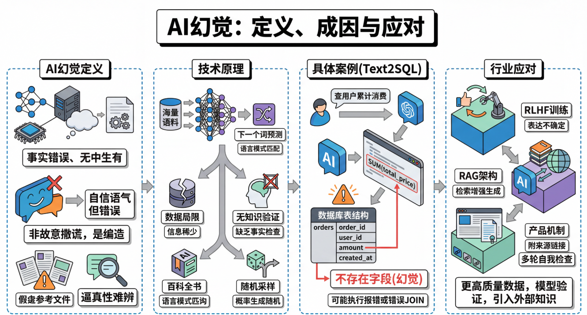
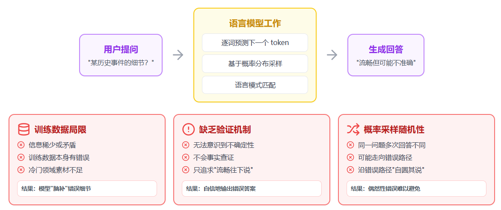

# AI 幻觉：大语言模型的"睁眼说瞎话"问题

## 一、什么是 AI 幻觉（定义与现象）

**AI 幻觉（AI Hallucination）** 是指大语言模型在生成回答时，以极其自信和流畅的语气，输出了事实上不正确、无中生有、或与现实不符的内容。它不是"故意撒谎"，而是模型在生成过程中"编造"了看起来合理但实际上错误的信息。

### 典型案例

以下几个例子可以帮助读者直观感受 AI 幻觉现象：

- **虚构论文**：你要求模型列举参考论文列表，它可能会列出几篇根本不存在的论文，标题、期刊、年份一应俱全，看起来非常真实
- **编造判例**：你询问某个法律案例，它可能引用一个完全虚构的判例
- **杜撰情节**：你让它介绍一本书的内容，它可能把情节和人物关系说得头头是道，但全是编的

### 幻觉的危险性

这里需要特别强调一个关键点：**幻觉之所以危险，恰恰在于它的"逼真性"**——它不是一眼能看出来的胡言乱语，而是包裹在流畅、专业、自信语气里的错误信息，非专业人士很难分辨。

## 二、为什么会产生幻觉（技术原理）

要理解幻觉的成因，需要先简单了解大语言模型的工作方式。**大语言模型本质上是一个"下一个词预测器"**——它在海量文本上训练后，学会了给定前文时，预测下一个最可能出现的词（token）。它的核心能力是语言模式的匹配与生成，而不是像数据库那样"查找事实"。

这个机制导致了几个层面的幻觉来源。

### 1. 训练数据的局限

模型的知识来自训练语料，如果语料中某个领域的信息稀少、矛盾或本身就有错误，模型就缺乏可靠的"素材"来生成准确回答。比如一个非常冷门的历史事件，训练数据中只有零星且相互矛盾的记载，模型就很容易"脑补"出错误细节。

### 2. 缺乏真正的"知识验证机制"

人类在说话时，如果不确定一件事，通常会意识到自己不确定，然后选择说"我不太清楚"。但语言模型在生成文本时，并没有一个独立的模块去检查"我刚才说的这句话在事实上是否正确"。它只是在不断选择统计上最合理的下一个词，整个过程更像是"流畅地往下说"，而不是"先查证再开口"。

### 3. 概率采样带来的随机性

模型在生成时会从概率分布中采样，这意味着同一个问题问两次，可能得到不同的回答，有时候某次采样就恰好走向了一条错误的路径，然后模型会沿着这条错误路径继续"自圆其说"下去。

### 形象比喻

一个很好的比喻是：**大语言模型更像一个博览群书、记忆力惊人但偶尔会把不同书里的内容张冠李戴的"讲故事高手"**，而不是一个严谨的百科全书查询系统。

## 三、AI 幻觉的具体案例（Text2SQL）

AI 幻觉是指大语言模型以自信、流畅的语气，输出事实上不正确或凭空捏造的内容。它的危险之处在于：**看起来太像真的了，普通人很难一眼辨别**。

### Text2SQL 场景示例

假设你的数据库里有一张 `orders` 表，字段是 `order_id`, `user_id`, `amount`, `created_at`。

你问 AI："帮我查每个用户的累计消费金额"，它生成了：

```sql
SELECT user_id, SUM(total_price) AS total_spent
FROM orders
GROUP BY user_id;
```

### 问题分析

这条 SQL 语法完全正确，逻辑看起来也对，但问题是——**你的表里根本没有 `total_price` 这个字段，实际应该用 `amount`**。

模型"自信地"编造了一个不存在的列名，而如果你不熟悉表结构，很可能直接拿去执行，直到数据库报错才发现问题。

### 更隐蔽的风险

更隐蔽的情况是，如果数据库里恰好有另一张表存在 `total_price` 字段，模型可能还会自作主张地去 JOIN 错误的表，生成一条能跑通但结果完全不对的查询——**这种错误比报错更危险**。

## 四、行业在如何应对幻觉（缓解方法）

### 训练层面的改进

**RLHF（基于人类反馈的强化学习）** 等技术让模型学会在不确定时表达不确定，而不是硬编一个答案。更高质量、更经过筛选的训练数据也有助于减少错误信息的来源。

### 架构层面的优化

**RAG（检索增强生成）** 是目前最主流的缓解手段之一。它的核心思路是：

- 让模型在回答问题时，先从一个可靠的知识库中检索相关文档
- 再基于检索到的内容来生成回答，而不是完全依赖自身"记忆"
- 这相当于给模型配了一本可以随时翻阅的参考书

### 产品层面的保障

很多 AI 应用开始采取以下措施：

- **信息溯源**：在回答中附上信息来源的引用链接，方便用户自行核实
- **多轮自我检查**：引入"多轮自我检查"机制，让模型对自己生成的内容进行二次验证

---

> **总结**：AI 幻觉是大语言模型当前无法完全避免的问题，但通过技术改进和产品设计，可以有效降低其影响。使用 AI 时保持批判性思维，对关键信息进行人工核验，仍然是必要的。