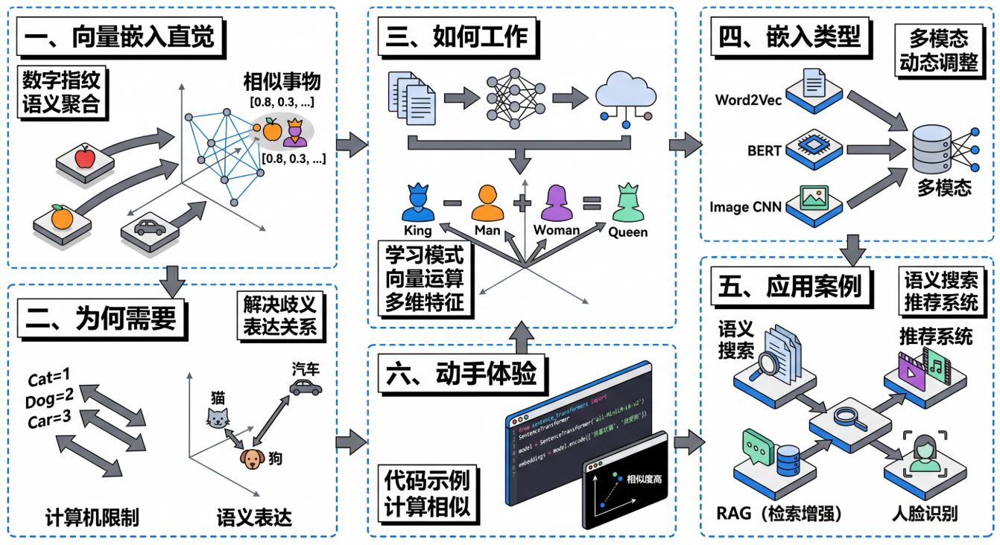
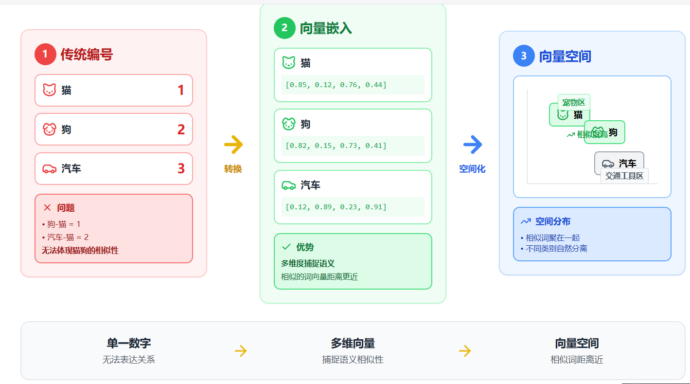

# 向量嵌入入门指南

## 一、什么是向量嵌入（从直觉开始）

想象你要向计算机解释"苹果"和"橙子"很相似，但"苹果"和"汽车"完全不同。你会怎么做？**向量嵌入就是给每个词、句子或物体分配一串数字，就像给它们一个"数字指纹"或"坐标地址"。**

比如"国王"可能是 `[0.8, 0.3, 0.9, 0.2]`，"王后"是 `[0.75, 0.35, 0.85, 0.25]`。这些数字看起来很接近对吧？而"香蕉"可能是 `[0.1, 0.9, 0.2, 0.8]`，和前两个完全不同。

**核心思想很简单：相似的事物在数字空间中距离更近。** 就像在地图上，北京和天津离得近，北京和纽约离得远一样。我们把所有词语放在一个多维空间里，意思相近的词会自然聚在一起——所有水果挨在一起，所有动物挨在一起，所有交通工具挨在一起。

## 二、为什么需要向量嵌入

计算机说到底只认识数字，它无法直接理解"爱"、"恨"、"猫"这些文字的含义。我们必须把这些信息转化为数字，机器才能处理。

最简单的方法是给每个词编个号：猫=1，狗=2，汽车=3。但这样有个大问题——计算机会觉得"猫"和"狗"的差异，跟"猫"和"汽车"的差异一样大，都相差1。但实际上猫和狗都是宠物，它们应该更相似才对。

**向量嵌入解决了这个问题。** 通过多个维度的数字组合，它能表达出"猫和狗都是动物"、"国王和王后都是皇室成员"这样的语义关系。更神奇的是，这些向量还能进行数学运算，帮助机器理解类比关系。

正是因为有了向量嵌入，搜索引擎才能理解你的搜索意图，推荐系统才能猜到你喜欢什么，ChatGPT才能读懂你的问题。

## 三、向量嵌入如何工作（简化原理）

向量嵌入是怎么学会的呢？简单说，就是让计算机阅读海量文本，观察"哪些词经常一起出现"。

比如计算机读了上万篇文章后发现："国王"经常和"王后"、"城堡"、"王国"一起出现；"苹果"经常和"水果"、"香蕉"、"吃"一起出现。通过这种统计模式，它就能学会把相似的词映射到相似的向量上。

**最著名的例子是：** `king（国王）- man（男人）+ woman（女人）≈ queen（王后）`。这个向量运算竟然能捕捉到性别转换的关系！类似的，`Paris（巴黎）- France（法国）+ Italy（意大利）≈ Rome（罗马）`，捕捉到了"首都"这个概念。

每个向量通常有几百个维度，每个维度可能隐含地捕捉某种特征——性别、时态、情感色彩、抽象程度等。虽然我们无法明确说出"第37维代表什么"，但整体组合起来就能精准表达语义。

衡量两个向量的相似度常用**余弦相似度**或**欧氏距离**。距离越近，意思越相似。

## 四、向量嵌入的类型

**词嵌入**是最基础的类型，像 Word2Vec、GloVe 这样的模型能给每个单词生成一个固定的向量。"猫"永远是同一个向量，不管它出现在什么句子里。

但这有个问题："银行"在"河岸边的银行"和"去银行取钱"中意思完全不同。所以出现了**句子嵌入**和**上下文嵌入**，能根据整句话的意思动态调整每个词的向量。BERT、GPT 这类模型就采用这种方式。

不仅文字可以嵌入，**图像**也可以。卷积神经网络能把一张照片转化为向量，相似的图片（比如都是猫的照片）会有相似的向量。

最前沿的是**多模态嵌入**，比如 CLIP 模型能把文字和图片映射到同一个向量空间。这样你输入"日落时的海滩"，系统就能找到匹配的照片；或者给一张图片，系统能生成描述文字。

## 五、实际应用案例

### 语义搜索
当你在搜索引擎输入"如何缓解压力"，即使文章里没有这几个字，系统也能找到谈"减压方法"、"放松技巧"的内容。这就是语义搜索，它比对的是向量相似度而非关键词匹配。

### 推荐系统
推荐系统把你看过的电影、听过的歌转化为向量，然后在向量空间中找到相似的作品推荐给你。这比传统的"喜欢这部电影的人还喜欢..."更精准，因为它能理解内容本身的相似性。

### 检索增强生成（RAG）
ChatGPT 等 AI 助手在回答问题时，会先把你的问题转化为向量，然后在知识库中搜索向量相似的内容，再基于这些内容生成回答。这个过程叫做检索增强生成（RAG）。

### 人脸识别
人脸识别系统会把每张人脸转化为一个向量，然后通过比对向量距离来判断是否是同一个人。即使拍摄角度、光线、表情不同，同一个人的人脸向量仍然会很接近。

## 六、动手体验

如果你想亲自体验，可以试试在线的词向量可视化工具，输入几个词比如"国王"、"王后"、"男人"、"女人"，看看它们在二维空间中的位置关系。

或者用 Python 代码试试：

```python
from sentence_transformers import SentenceTransformer

model = SentenceTransformer('all-MiniLM-L6-v2')

sentences = ['我喜欢猫', '我爱狗', '今天天气不错']
embeddings = model.encode(sentences)

# 计算相似度，你会发现前两句更相似
```

**提示：** 第一次运行时，程序会自动下载模型文件（约90MB），需要稍等片刻。你可以进一步计算余弦相似度来查看具体的相似程度。

---

**相关资源：**
- [Sentence Transformers 官方文档](https://www.sbert.net/)
- [Word2Vec 原理详解](https://arxiv.org/abs/1301.3781)
- 在线词向量可视化工具：Embedding Projector