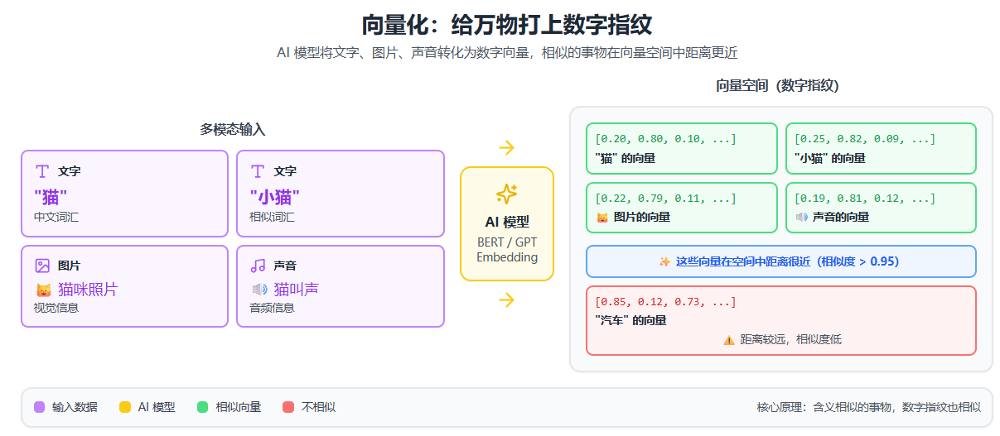

# 向量数据库：AI 时代的核心基础设施

## 一、一个真实问题

想象你在使用 ChatGPT 处理工作文档。你上传了一份 200 页的公司手册，然后问"我们的年假政策是什么？"AI 瞬间就能找到相关段落并回答你。这背后不是把整个手册都塞进 AI 的"大脑"，而是用了一种特殊的数据库——**向量数据库**。它能理解你问题的"意思"，然后在海量信息中找到语义最相关的内容。

传统搜索引擎只能匹配关键词，搜"苹果手机"找不到"iPhone"。但向量数据库不一样，它能理解这两个词指的是同一样东西。这种"理解语义"的能力，正是 AI 时代最关键的技术基础之一。从智能客服到个性化推荐，从以图搜图到 AI 助手，向量数据库都在幕后默默工作。

## 二、什么是向量？先理解基础概念

向量听起来很数学，但其实可以理解为给每样东西打上一串"数字指纹"。比如"猫"这个词可能被转化为 `[0.2, 0.8, 0.1, 0.6, ...]`，"小猫"可能是 `[0.25, 0.82, 0.09, 0.58, ...]`。你看，这两串数字很接近对吧？这就是重点——**含义相似的东西，它们的数字指纹也相似**。这些数字不是随便编的，而是 AI 模型（比如 BERT、GPT）通过学习海量文本"理解"出来的。

这个过程叫做**"向量化"或"Embedding"**。神奇的是，不仅文字可以变成向量，图片、声音、视频都可以。一张猫的照片和"猫"这个词的向量在数字空间里会靠得很近。这就是为什么你能用一张图片去搜索相似的图片，或者用文字描述去找图片——它们在向量空间里是可以对话的。

## 三、传统数据库 vs 向量数据库

**传统数据库**（像 MySQL、PostgreSQL）擅长精确查找。你查"订单号 12345"，它能瞬间找到。但如果你问"帮我找去年买过的蓝色运动鞋"，传统数据库就抓瞎了——除非你的商品描述里恰好有"蓝色"和"运动鞋"这几个字。它无法理解"耐克跑鞋"和"运动鞋"其实是一回事，也不知道"天蓝色"和"蓝色"很接近。

**向量数据库**专门解决这个问题。它不关心文字是否完全匹配，而是计算语义的相似度。查询"如何煮意面"能找到"意大利面烹饪方法"，因为它们在向量空间里距离很近。更重要的是，向量数据库针对"相似性搜索"做了优化，能在数百万甚至数十亿个向量中快速找到最相似的那几个。传统数据库要做这件事，要么慢得让人崩溃，要么根本做不到。

## 四、向量数据库如何工作？

整个流程分四步：

**第一步：向量化**

你输入一段文字"今天天气真好"，AI 模型（比如 OpenAI 的 text-embedding 模型）把它转成一个 1536 维的向量——也就是 1536 个数字组成的数组。

**第二步：索引构建**

向量数据库用特殊算法（比如 HNSW、IVF）把这些向量组织成类似"导航地图"的结构，让搜索更快。

**第三步：相似性搜索**

当你查询"天气不错"时，系统先把这句话也向量化，然后在向量空间里计算距离（常用余弦相似度或欧式距离），找到最近的几个邻居。

**第四步：返回结果**

把这些向量对应的原始数据（可能是文档片段、商品信息、图片）返回给你。整个过程可能只需要几十毫秒，即使数据库里有上亿条记录。

## 五、向量数据库能做什么？实际应用场景

最火的应用是 **RAG（检索增强生成）**——让 ChatGPT 基于你自己的文档回答问题。比如你把公司所有技术文档存进向量数据库，员工问"怎么配置 VPN"，系统先从数据库检索相关段落，再让 AI 基于这些内容生成回答。这样 AI 不会瞎编，答案都有据可查。法律咨询、医疗问答、客服机器人都在用这个技术。

## 六、向量数据库的优势

- **高效相似性搜索**：通过 ANN 算法实现 O(log n) 时间复杂度，比传统数据库的精确搜索 O(n) 快很多

- **混合查询能力**：可同时处理"找到与这张图片相似且价格低于 100 元的产品"这类复合查询

- **AI 应用集成**：特别适合实现 RAG 架构中的长期记忆模块

- **规模可扩展性**：支持海量向量数据的存储和检索

- **多模态支持**：同时处理文本、图像、音频等不同类型的嵌入向量

- **实时性能**：支持高并发、低延迟的查询操作

---

*通过向量数据库，AI 不再只是"会说话"，而是真正能"理解"和"记忆"信息，成为你的智能助手。*