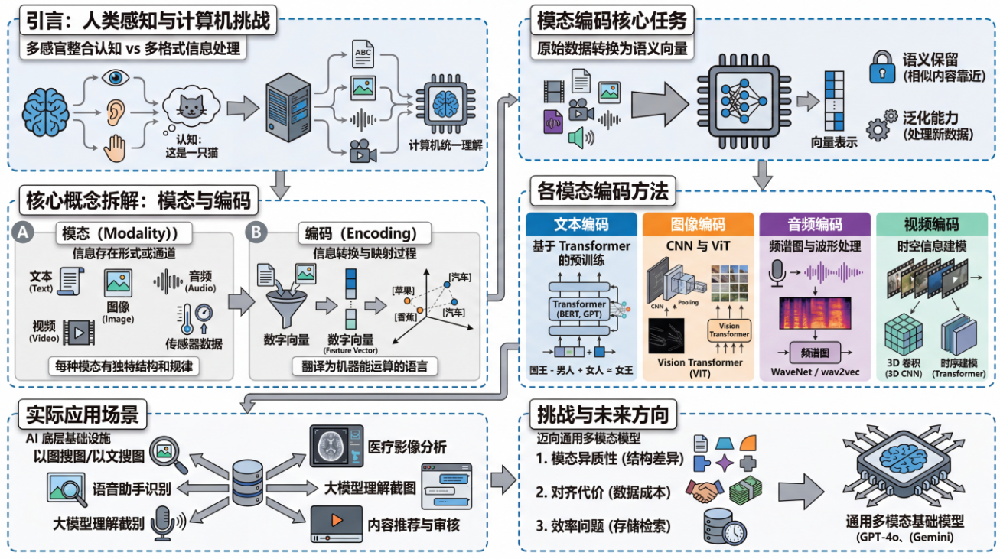
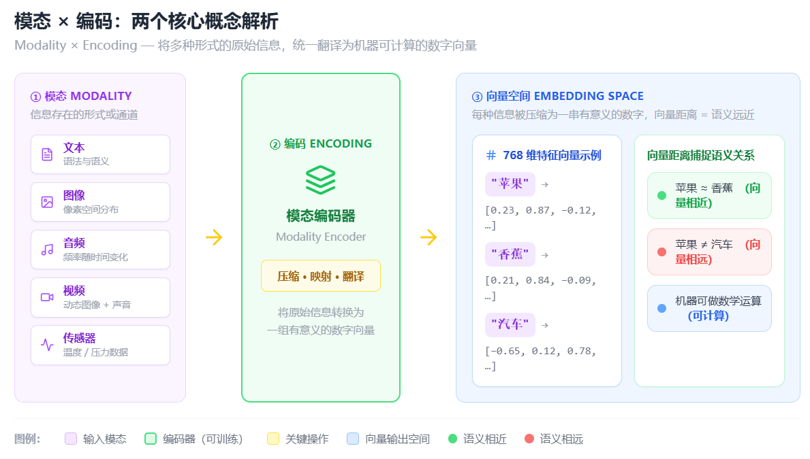

# 模态编码：让计算机统一理解多种形式信息的方法论

## 一、引言：从你感知世界的方式说起

人类理解世界不靠单一渠道。你看到一只猫，会看它的样子、听它的叫声、甚至摸它的毛——这些来自不同感官的信息，你的大脑会自然地整合起来，形成"这是一只猫"的认知。

计算机也面临同样的问题：它需要处理文字、图片、声音、视频等各种形式的信息。但这些信息在格式上天差地别，一段文字是字符序列，一张图片是像素矩阵，一段音频是波形数据。**模态编码，就是解决"如何让计算机统一理解这些不同形式信息"的那套方法论。**

---

## 二、两个核心词拆开讲

### 什么是"模态"

**"模态"（Modality）** 在这里指的是信息存在的形式或通道。常见的模态包括：

- **文本**：语言文字
- **图像**：照片、图表
- **音频**：语音、音乐
- **视频**：动态图像 + 声音
- **传感器数据**：温度、压力等

每种模态都有自己的结构和规律。文字有语法和语义，图像有像素的空间分布，音频有频率随时间的变化。它们各自遵循截然不同的"物理规则"。

### 什么是"编码"

**"编码"（Encoding）** 是将信息转换成另一种形式以便处理、传输或存储的过程。在机器学习的语境里，编码特指将原始数据压缩、映射成一组**数字向量**（也叫"特征向量"或"嵌入"，Embedding）。

你可以把编码理解成一种"翻译"：把人类世界的原始信息，翻译成机器能做数学运算的语言——**一串有意义的数字**。

> 比如，"苹果"这个词被编码后，可能变成一个 768 维的向量，而"香蕉"的向量与之相近，"汽车"的向量则相差很远。这种向量空间中的距离关系，就捕捉了语义上的远近。

---
## 三、模态编码的核心任务

把前两个概念合在一起，**模态编码的核心任务**就是：

> 针对不同模态的原始数据，设计专门的模型或算法，将其转换为向量表示，并尽可能让这个向量保留原始信息中有意义的语义内容。

一个好的模态编码器有两个基本要求：

| 要求 | 说明 |
|------|------|
| **语义保留** | 相似的内容编码后在向量空间中应该相互靠近 |
| **泛化能力** | 没见过的新数据也能被合理地编码 |

---

## 四、各模态是怎么被编码的

### 文本编码

- **早期方法**：one-hot 编码或 TF-IDF，简单但无法表达语义。
- **重要突破**：词向量（Word2Vec、GloVe），第一次让"国王 - 男人 + 女人 ≈ 女王"这样的语义运算成为可能。
- **现代主流**：基于 Transformer 架构的预训练模型，例如 **BERT**、**GPT 系列**。这类模型通过在海量文本上预训练，能够根据上下文动态生成词语的表示，大幅提升了语义理解能力。

### 图像编码

- **经典路线**：卷积神经网络（CNN）。CNN 通过层层卷积，从像素出发，逐步提取边缘、纹理、形状，最终得到高层语义特征。
- **新兴方向**：视觉 Transformer（**ViT**），将图像切成小块（patch），用类似处理文本的方式来编码图像，效果往往更好。

### 音频编码

音频通常先被转换成**频谱图（Spectrogram）**——一种将时间-频率关系可视化的二维表示，然后再用类似图像的编码方式处理。也有模型直接从原始波形学习特征，比如 **WaveNet** 和 **wav2vec**。

### 视频编码

视频是图像序列加上音频的组合，复杂度更高。视频编码往往要同时捕捉：

- **空间信息**：每帧画面中有什么
- **时序信息**：帧与帧之间如何变化

常见方法包括 **3D 卷积** 和基于 Transformer 的时序建模。

---

## 五、模态编码的实际应用

模态编码是现代 AI 应用的**底层基础设施**，它的影子几乎无处不在：

| 应用场景 | 依赖的编码类型 |
|----------|----------------|
| 以图搜图、以文搜图（语义图库搜索） | 图文多模态编码 |
| 语音助手的语音识别 | 音频编码 |
| 医疗 AI 分析 CT 影像 | 图像编码 |
| 大语言模型理解上传的截图 | 视觉编码器 |
| 视频平台内容推荐与审核 | 视频编码 |

---

## 六、挑战与未来方向

### 当前面临的核心挑战

1. **模态异质性**：不同模态的数据分布、结构差异巨大，如何设计统一的编码框架是难题。
2. **对齐的代价**：多模态对齐通常需要大量的配对数据（比如成千上万的图文对），而这类数据的获取成本很高。
3. **效率问题**：高维向量的存储和检索在工程上挑战不小。

### 未来趋势

未来的趋势是走向**通用多模态基础模型**（General-purpose Multimodal Foundation Models）——即一个模型能够统一处理任意模态的输入和输出，就像人类的大脑一样，不区分"这是视觉任务"还是"这是语言任务"，而是融合所有感知通道，形成整体的理解。

**GPT-4o** 和 **Gemini 系列**已经在朝这个方向迈进。