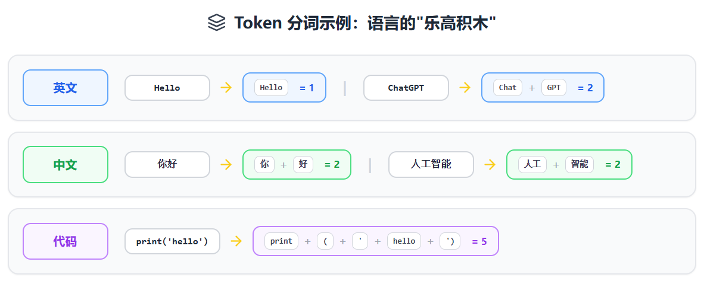
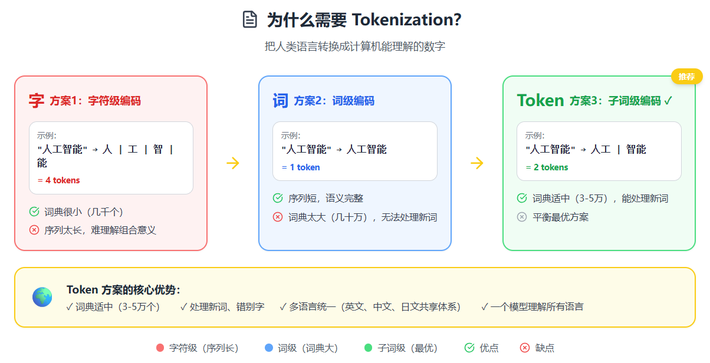

# LLM中的Token是如何计算的？完全指南

## 一、什么是Token？

当你和ChatGPT聊天时，无论你输入"你好"还是"Hello"，背后都在发生一件事：你的文字被切成了一个个叫做"Token"的小单位。

可以把Token想象成**语言的乐高积木**。就像用乐高积木拼出各种造型，LLM用Token拼出所有的文字。但这里有个重要的认知：**Token ≠ 单词，也 ≠ 字**。

### 举几个实际例子：

**英文：**
- "Hello" = 1个token
- "Hello World" = 2个tokens（"Hello" + " World"，注意空格包含在第二个token里）
- "ChatGPT" = 2个tokens（"Chat" + "GPT"）
- "unhappiness" = 3个tokens（"un" + "happy" + "ness"）

**中文：**
- "你好" = 2个tokens（"你" + "好"）
- "人工智能" = 4-6个tokens（中文通常每个字1-2个token）
- "我爱吃火锅" ≈ 8-10个tokens

**符号和代码：**
- "print('hello')" ≈ 5个tokens
- "😊" = 1-2个tokens
- 一个空格或换行符 = 1个token

你可能会问：**为什么不直接用完整的单词或汉字？**

因为现实世界的词汇是无限的，每天都有新词出现（如"芭比Q了"、"YYDS"），如果为每个可能的词都建立一个编号，词典会大到无法处理。Token就是在"字符"和"完整词"之间找到的平衡点。

## 二、为什么需要Tokenization？

计算机的本质是在计算数字，它无法直接理解"你好"或"Hello"这些文字。必须有一个翻译过程，把人类的语言转换成计算机能处理的数字。这个过程就叫**Tokenization（分词）**。

### 核心问题：如何建立文字和数字的映射？

早期有三种思路：

**方案1：字符级编码**
- 把每个字母、汉字都单独编号
- **优点**：词典很小，只需几千个编号
- **缺点**：序列太长，"人工智能"变成4个独立的字，模型很难理解它们组合在一起的意思

**方案2：词级编码**
- 把每个完整的词都编号
- **优点**：序列短，"人工智能"就是1个单位
- **缺点**：词典太大（中文常用词就有几十万），处理不了新词、错别字

**方案3：子词级编码（Token的方案）**
- 把常见的词保留为整体，生僻词拆成更小的部分
- 比如"人工" = 1个token（常见词组），"智能" = 1个token，"芭比Q" = 可能拆成["芭", "比", "Q"]这样的组合

这就是现代LLM普遍采用的方案。它既能保持合理的词典大小（通常3-5万个token），又能处理任何新词、错别字甚至多语言混合的文本。

另一个重要原因是**多语言统一处理**。英文、中文、日文、阿拉伯文可以共享同一套token体系，一个模型就能理解所有语言，而不需要为每种语言单独训练。

## 三、Token是怎么切分的？

Token的切分不是人工规定的，而是从海量文本中统计学习出来的。最常用的算法叫**BPE（Byte Pair Encoding）**，让我们看看它是如何工作的：

### BPE算法的训练过程

假设我们有这样一个小语料库：

```
low low low low lower lower newest newest newest widest widest
```

**第一步：从字符开始**

初始状态，把所有词拆成单个字符：

```
l o w  l o w  l o w  l o w  l o w e r  l o w e r  n e w e s t ...
```

**第二步：统计相邻字符对的频率**

- "l" + "o" 出现了6次
- "o" + "w" 出现了6次
- "w" + "e" 出现了2次
- "e" + "s" 出现了3次

**第三步：合并最频繁的字符对**

"l" + "o" 最常见，合并成一个新token "lo"：

```
lo w  lo w  lo w  lo w  lo w e r  lo w e r  n e w e s t ...
```

**第四步：重复统计和合并**

现在 "lo" + "w" 出现了6次，合并成 "low"：

```
low  low  low  low  low e r  low e r  n e w e s t ...
```

继续这个过程几千次，直到达到预设的词汇表大小（如50000个token）。最终形成一个词汇表：

```
1: "l"
2: "o"
3: "w"
4: "lo"
5: "low"
6: "lower"
7: "new"
8: "newest"
...
```

### 应用到新文本

当你输入"lower"时，算法会执行以下步骤：

1. **第一步**：查找词汇表中最长的匹配
2. **第二步**：如果"lower"在词汇表中有完整的token就直接使用
3. **第三步**：如果输入"lowerest"（不在词汇表）就拆成 ["lower", "est"] 或 ["low", "er", "est"]

这就是为什么：
- "beautiful" 可能被切成 ["beaut", "iful"]
- "unbelievable" 可能被切成 ["un", "believ", "able"]
- "人工智能" 可能被切成 ["人工", "智能"] 或 ["人", "工", "智", "能"]

**关键规则**：优先使用更长的、更完整的token。

## 四、不同语言的Token消耗差异

这是很多中文用户感到"肉疼"的地方：**同样的意思，中文比英文贵很多**。

### 实际对比测试

让我们用"你好，世界！"和"Hello, World!"来测试（使用GPT-4的tokenizer）：

**中文：** "你好，世界！"

```json
Token数：11个
详细切分：["你", "好", "，", "世", "界", "！"]
（实际上每个汉字可能占1-2个token，标点也算）
```

**英文：** "Hello, World!"

```json
Token数：4个
详细切分：["Hello", ",", " World", "!"]
```

**相同的意思，中文的token消耗是英文的2-3倍！**

### 为什么会这样？

根本原因是**训练数据的语言分布**：

- GPT模型的训练语料中，英文约占70-80%
- 中文约占5-10%
- 其他语言占比更少

在BPE训练过程中，英文词汇因为出现频率高，更容易被合并成完整的token。比如"the"、"and"、"is" 这些超高频英文词都是独立的1个token，而"人工智能"、"机器学习" 这些中文词组出现频率相对较低，被拆得更碎。

### 五、各语言的Token效率排名

根据OpenAI的统计数据：

| 语言 | 平均1个词的Token数 | Token效率 |
|------|-------------------|-----------|
| 英语 | 1.3 | ⭐⭐⭐⭐⭐ |
| 法语、西班牙语 | 1.8 | ⭐⭐⭐⭐ |
| 中文 | 2.0（每个字） | ⭐⭐⭐ |
| 日语 | 2.5（每个字） | ⭐⭐ |
| 阿拉伯语、韩语 | 3.0+ | ⭐ |

### 实际影响：

如果用GPT-4 API，同样表达一个想法：
- **英文prompt**：消耗1000 tokens × $0.03 = **$0.03**
- **中文prompt**：消耗2000 tokens × $0.03 = **$0.06**

**成本翻倍！**

## 六、如何计算和查看Token数？

### 在线工具

这里可以推荐一个：**OpenAI Tokenizer**（最准确）

网址：https://platform.openai.com/tokenizer