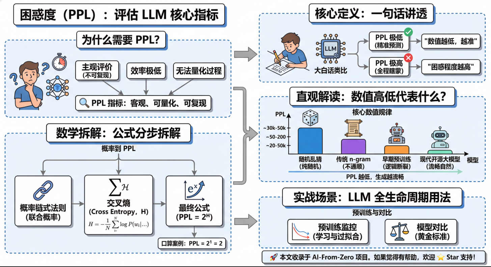
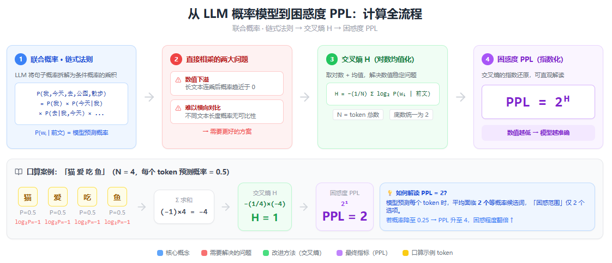

# 困惑度（Perplexity）：评估大语言模型的核心指标

## 一、为什么我们需要「困惑度」这个指标？

评价一个大语言模型好不好，最直观的感受是「用着爽不爽」，但这种主观评价存在 3 个致命缺陷：

1. **不可复现**：你觉得好用的模型，我可能觉得答非所问，没有统一标准；
2. **效率极低**：不可能在模型训练的每一步，都找大量人来做人工打分；
3. **无法量化过程**：模型训练时，我们需要一个精准的数字，实时判断「模型是变好了还是变差了」。

因此，我们需要一个**客观、可量化、可复现**的指标，来衡量 LLM 最底层、最核心的能力 —— 对人类语言的建模能力。而**困惑度（Perplexity，简称 PPL）** 是评估语言模型（LLM）性能的关键指标。它衡量模型在预测文本序列时的不确定性程度，用于量化模型对未见过的数据的预测能力。

---

## 二、核心定义：一句话讲透什么是困惑度

**困惑度，是衡量大语言模型对文本序列的预测不确定性的核心指标。**

> 💡 核心结论先记牢：**数值越低**，模型对下一个词的预测越准，对人类语言的理解和建模能力越强，「困惑」程度就越低。

### 大白话类比

你可以把 LLM 想象成一个做「完形填空」的学生，它的核心任务就是根据前文，精准预测下一个词是什么。

- 学生每次都能精准猜到正确答案，几乎不犹豫 → **困惑度极低**；
- 学生全程瞎蒙，完全不知道该填什么 → **困惑度极高**。

---

## 三、数学拆解：从 LLM 本质到困惑度公式（大白话版）

### 前置知识：LLM 的本质是概率模型

大语言模型的核心任务，就是给任意一段自然语言，计算出它「符合人类语言习惯」的概率。比如句子「我今天去公园散步」，LLM 会通过**概率链式法则**，把整个句子的联合概率，拆解成每个词的条件概率的乘积：

$$
P(\text{我,今天,去,公园,散步}) = P(\text{我}) \times P(\text{今天}|\text{我}) \times P(\text{去}|\text{我,今天}) \times P(\text{公园}|\text{我,今天,去}) \times P(\text{散步}|\text{我,今天,去,公园})
$$

其中，$P(w_i \mid \text{前文})$ 就是模型根据前面的所有内容，预测第 $i$ 个词（token）是 $w_i$ 的概率。

### 从概率到困惑度：公式分步拆解

直接用概率相乘有两个问题：长文本会出现**数值下溢**，且不便于横向对比。因此行业先通过对数概率计算**交叉熵**，再通过指数转换得到**困惑度**。

#### 步骤 1：交叉熵（Cross Entropy）计算

交叉熵是衡量模型预测概率和真实分布差距的核心指标，公式如下：

$$
H = -\frac{1}{N} \sum_{i=1}^{N} \log_2 P(w_i \mid w_1, w_2, \ldots, w_{i-1})
$$

- **$N$**：文本的总 token 数（日常科普中可简单理解为「词数」）；
- **$P(w_i \mid w_1, w_2, \ldots, w_{i-1})$**：模型预测第 $i$ 个 token 的条件概率；
- **$\log_2$**：以 2 为底的对数（行业也有用自然对数 $e$ 的，对比时需保持底数一致）。

#### 步骤 2：困惑度最终公式

困惑度是交叉熵的指数形式，公式极简：

$$
\text{PPL} = 2^H
$$

### 极简口算案例，秒懂公式

我们用一个 4 个 token 的句子「猫 爱 吃 鱼」举例（$N=4$），假设模型给每个 token 的条件概率都是 $0.5$：

1. 每个 token 的 $\log_2 P$：$\log_2 0.5 = -1$，4 个 token 合计求和为 $-4$；
2. 代入交叉熵公式：$H = -\frac{1}{4} \times (-4) = 1$；
3. 计算困惑度：$\text{PPL} = 2^1 = 2$。

这个结果的大白话含义是：模型预测每个 token 时，**平均有 2 个等概率的选项可选**，它的「困惑范围」是 2 个 token。如果模型预测的平均概率降到 $0.25$，PPL 就会升到 $4$，模型的困惑程度直接翻倍。

---

## 四、直观解读：困惑度的数值高低，到底代表什么？

### 核心数值规律

1. PPL 的理论最小值为 **1**，代表模型对每一个 token 的预测概率都是 100%，完全无不确定性（实际场景中不可能、也不应该达到）；
2. **PPL 永远 ≥ 1**，不可能出现负数或小于 1 的情况；
3. 同等测试条件下，**PPL 越低，模型生成文本的流畅度、通顺度越好**；
4. PPL 数值对词表规模、测试集难度高度敏感，**跨场景对比无意义**。

### 行业通用参考范围

> 基于英文通用语料 WikiText-103，3~5 万词表

| 模型类型 | 典型困惑度范围 | 直观解读 |
|:---|:---:|:---|
| 随机乱猜 | 30000 ~ 50000 | 完全不懂语言规律，纯随机选词 |
| 传统 n-gram 模型 | 50 ~ 200 | 仅能捕捉短距离语言规律，生成句子经常不通顺 |
| 早期预训练模型（GPT-1 / BERT） | 20 ~ 50 | 能生成通顺句子，但长文本易出现逻辑断裂 |
| 现代开源大模型（Llama 3 / Mistral） | 5 ~ 15 | 语言建模能力极强，生成文本流畅自然，符合人类语言习惯 |

---

## 五、实战场景：困惑度在 LLM 全生命周期的核心用法

### 1. 预训练过程的核心监控指标

这是 PPL 最核心的用途。LLM 预训练的每一步，都会同步计算训练集和验证集的 PPL：

- **训练集 PPL 持续下降**：模型正在有效学习语言规律，训练方向正确；
- **验证集 PPL 下降后开始上升**：模型出现**过拟合**，需及时停止训练或调整正则化策略。

可以说，没有 PPL，就无法高效完成 LLM 的预训练。

### 2. 模型基线对比的黄金标准

在学术论文、开源模型发布时，PPL 是必放的基线指标。只有在**完全相同**的测试集、分词器 / 词表、上下文长度、计算底数的前提下，对比不同模型的 PPL，才能客观证明「我的模型语言建模能力更优」。