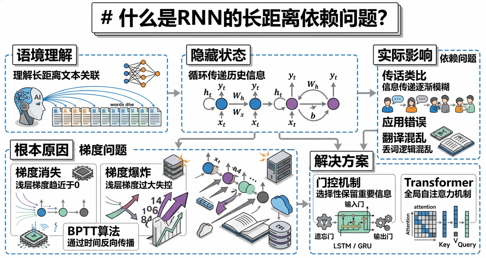
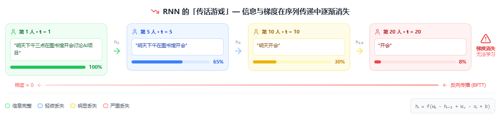

# 什么是RNN的长距离依赖问题？

> by @Laizhuocheng

## 一、为什么需要理解长距离依赖

在自然语言处理中，理解一句话往往需要跨越很长的距离。比如这句话："张三昨天在图书馆借了一本关于人工智能的书，他认为这本书非常有趣。"

要正确理解"他"指的是谁，模型需要记住开头提到的"张三"，即使中间隔了十几个词。这种跨越长距离建立联系的能力，就是**长距离依赖**。

**第一是语义完整性。** 很多句子的关键信息分散在不同位置。如果模型只能看到局部上下文，就会丢失重要的语义联系，导致理解错误。

**第二是指代消解。** 人类语言中大量使用代词（他、她、它、这、那），要正确理解这些代词的含义，必须能够回溯到前面提到的实体。

**第三是逻辑连贯性。** 复杂的论述、故事或技术文档往往需要在多个句子之间保持逻辑一致性，这要求模型具备长期记忆能力。

---

## 二、什么是RNN的长距离依赖问题

RNN（循环神经网络）是一种专门处理序列数据的神经网络架构。它的核心思想是：**在处理当前输入时，不仅要考虑当前的输入，还要考虑之前所有输入的信息**。

RNN通过一个"隐藏状态"来传递历史信息。想象RNN是一个传话游戏：第一个人听到一句话，然后悄悄告诉第二个人，第二个人再告诉第三个人，以此类推。

**长距离依赖问题**就是指：当信息需要从序列开头传递到序列末尾时，RNN很难保持信息的完整性。就像传话游戏中，经过太多人转述后，原始信息会变得模糊甚至完全错误。

这个问题的根本原因是RNN在训练过程中面临的**梯度消失**和**梯度爆炸**问题，导致网络难以学习跨越很多时间步的依赖关系。

---

## 三、RNN如何工作以及问题所在

### 3.1 RNN的基本机制：隐藏状态的传递

RNN在每个时间步t都会：
1. 接收当前输入x_t
2. 接收前一个时间步的隐藏状态h_{t-1}
3. 计算新的隐藏状态h_t = f(W_h * h_{t-1} + W_x * x_t + b)
4. 基于h_t生成输出

这个隐藏状态h_t理论上包含了从开始到当前的所有信息。

### 3.2 梯度消失问题：信息的逐渐衰减

在训练RNN时，使用的是**反向传播通过时间**（BPTT）算法。当计算早期时间步的梯度时，需要对权重矩阵进行多次乘法运算。

如果权重矩阵的特征值小于1，多次相乘后梯度会趋近于0（梯度消失）；如果大于1，梯度会爆炸式增长（梯度爆炸）。这两种情况都导致RNN难以学习长距离依赖。

### 3.3 传话游戏的类比

想象一个传话游戏，有20个人排成一队：
- 第一个人听到："明天下午三点在图书馆开会讨论人工智能项目"
- 经过5个人后，可能变成："明天下午在图书馆开会"
- 经过10个人后："明天在图书馆开会"
- 经过20个人后："开会"

关键信息（时间、主题）在传递过程中逐渐丢失，这就是RNN长距离依赖问题的直观体现。

---

## 四、RNN长距离依赖问题的优缺点

| 优点 | 缺点 |
|------|------|
| **简单直观** | **长距离依赖困难** |
| RNN结构简单，易于理解和实现 | 随着序列长度增加，信息传递效果急剧下降 |
| **参数共享** | **梯度问题严重** |
| 同一组参数处理所有时间步，减少参数数量 | 梯度消失/爆炸问题限制了有效记忆长度 |
| **适合短序列** | **训练困难** |
| 对于短文本或简单序列任务表现良好 | 需要复杂的技巧（如梯度裁剪）才能稳定训练 |

---

## 五、RNN长距离依赖问题的实际影响

### 5.1 机器翻译中的问题
在翻译长句子时，RNN可能忘记句子开头的主语，导致译文中的代词使用错误。比如把"他喜欢她"翻译成"她喜欢她"。

### 5.2 文本生成的质量下降
RNN生成的长文本往往会偏离主题，因为模型忘记了最初要表达的核心思想，导致内容重复或无关。

### 5.3 问答系统的准确性降低
当问题和答案相隔很远时，RNN很难建立正确的关联，导致问答系统给出错误答案。

### 5.4 语音识别的上下文错误
在长语音识别中，RNN可能无法正确利用远距离的上下文信息来纠正识别错误。

---

## 六、如何解决长距离依赖问题

### 6.1 LSTM和GRU：门控机制的引入

LSTM（长短期记忆网络）和GRU（门控循环单元）通过引入**门控机制**来解决这个问题：

- **遗忘门**：决定哪些信息需要保留，哪些可以丢弃
- **输入门**：控制新信息的流入
- **输出门**：控制信息的输出

这些门就像智能的过滤器，可以让重要信息长期保存，同时过滤掉不重要的噪声。

### 6.2 Transformer架构：完全抛弃循环

Transformer彻底放弃了RNN的循环结构，采用**自注意力机制**。每个位置都可以直接关注序列中的任何其他位置，无论距离多远。

这就像传话游戏中，每个人都可以直接听到原始消息，而不是依赖中间人的转述。

### 6.3 残差连接和层归一化

现代RNN变体还使用残差连接（ResNet-style connections）和层归一化（Layer Normalization）来缓解梯度问题，让信息更容易流动。

### 6.4 预训练和微调范式

通过在大规模语料上预训练，让模型学习通用的语言表示，然后再在特定任务上微调，这种方式也能在一定程度上缓解长距离依赖问题。

尽管RNN已经被Transformer等更先进的架构取代，但理解RNN的长距离依赖问题对于我们认识深度学习的发展历程和序列建模的本质仍然非常重要。