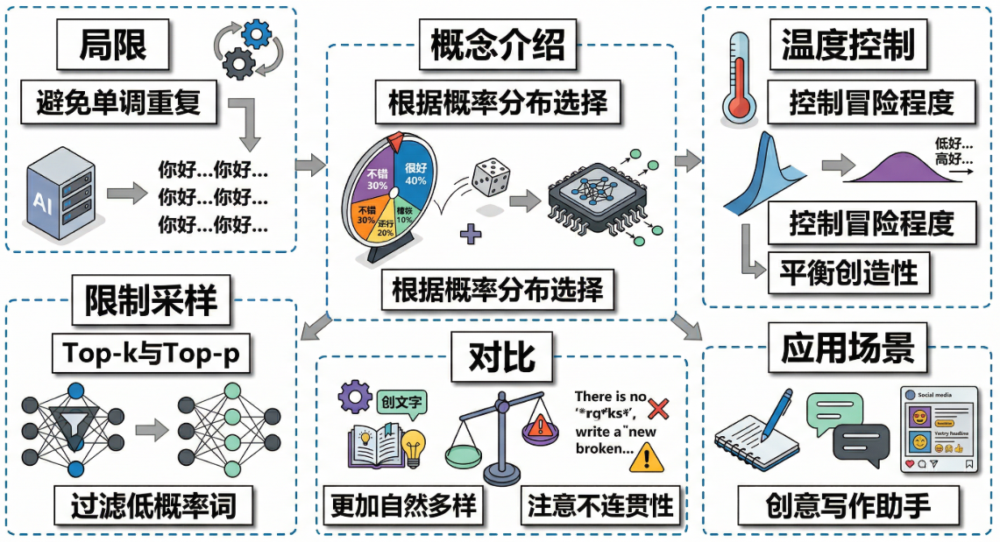
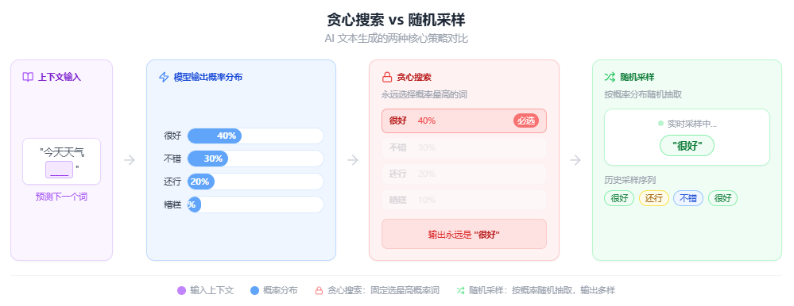

# 什么是随机采样？

> by @Laizhuocheng

---

## 一、为什么需要随机采样

**说人话就是：** 想象你和朋友聊天，如果每次都选"最安全"的回答，对话会变得像机器人。AI也一样，如果不给它一点随机性，它就会陷入重复和单调的陷阱。随机采样就像给AI一点"性格"，让它有时候冒险尝试不太常见但合理的表达，这样对话才更自然有趣。

想象一下你和朋友聊天的场景。如果你每次回答都选择"最安全"、"最正确"的词语，对话会变得多么无聊！比如别人问"今天过得怎么样？"，你每次都回答"很好，谢谢关心"，这听起来就像机器人在说话。

在AI文本生成中，如果我们总是选择概率最高的下一个词（这就是贪心搜索），AI就会陷入重复和单调的陷阱。就像一个人总是说同样的话，永远不会犯错，但也永远不会有趣。

随机采样的出现，就是为了解决这个"过于完美反而不真实"的问题。它给AI一点"犯错"的空间，让它能够产生更多样化、更自然的表达。

---

## 二、什么是随机采样

随机采样（Random Sampling）是一种文本生成策略，它不是简单地选择概率最高的下一个词，而是根据每个词的概率分布来随机选择下一个词。

具体来说，假设AI模型预测下一个词可能是：
- "很好"（概率40%）
- "不错"（概率30%）
- "还行"（概率20%）
- "糟糕"（概率10%）

在贪心搜索中，AI永远会选择"很好"。但在随机采样中，AI有40%的概率选择"很好"，30%的概率选择"不错"，以此类推。

这就像是给AI一个"性格"——有时候它会选择最稳妥的答案，有时候也会冒险尝试一些不太常见但仍然合理的表达。

---

## 三、随机采样如何工作

### 温度参数控制随机性

随机采样的核心是**温度参数**（Temperature）。这个参数控制着AI的"冒险精神"：

- **低温**（接近0）：AI变得更保守，倾向于选择高概率的词，结果更可预测但可能单调
- **高温**（大于1）：AI变得更冒险，低概率的词也有机会被选中，结果更多样化但可能不连贯
- **标准温度**（1.0）：保持原始概率分布，平衡创造性和合理性

### Top-k和Top-p采样

为了防止AI选择完全不相关的词，我们还有更精细的控制方法：

- **Top-k采样**：只考虑概率最高的k个词，然后在这k个词中进行随机选择
- **Top-p采样**（核采样）：选择累积概率达到p的最小词集，然后在这个集合中随机选择

这些技术确保AI在保持创造性的同时，不会完全失控。

## 四、随机采样的优缺点

| 优势 | 劣势 |
|------|------|
| 生成文本更加多样化和自然 | 可能产生不连贯或不合逻辑的内容 |
| 更接近人类的真实表达方式 | 结果具有随机性，难以完全复现 |
| 能够发现意想不到的创意组合 | 需要仔细调整参数以获得最佳效果 |
| 避免重复和单调的文本模式 | 在某些需要精确性的场景下可能不合适 |

---

## 五、随机采样的实际应用

1. **创意写作助手**：在写故事、诗歌或广告文案时，随机采样能帮助产生更多创意选项
2. **聊天机器人**：让对话更加自然和有趣，避免机械化的回复
3. **内容生成工具**：为社交媒体、博客等生成多样化的标题和内容
4. **语言学习应用**：展示同一意思的不同表达方式，帮助学习者理解语言的丰富性

## 六、随机采样的发展与演进

虽然随机采样解决了贪心搜索的单调性问题，但它也带来了新的挑战——如何在创造性和可控性之间找到平衡。

现代AI系统通常采用混合策略：
- **束搜索**（Beam Search）：在多个候选序列中进行选择，既考虑多样性又保证质量
- **对比解码**（Contrastive Decoding）：同时考虑正面和负面的例子，提高生成质量
- **受控生成**：通过提示工程或约束条件来引导随机采样的方向

未来的发展方向包括更好的参数自适应、上下文感知的随机性控制，以及结合人类反馈的强化学习方法。

---

> by @Laizhuocheng