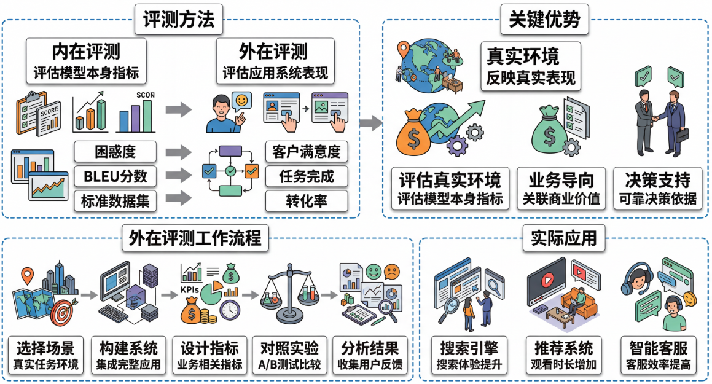
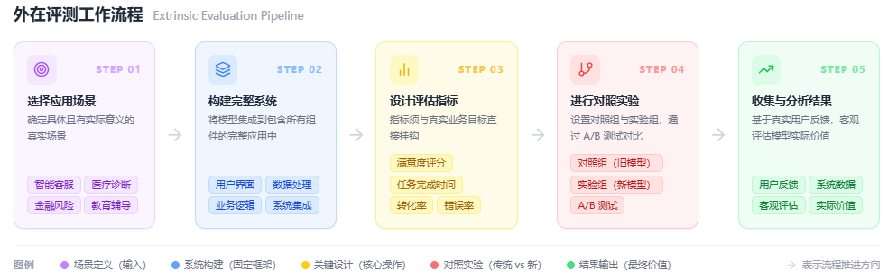

# 什么是外在评测？为什么最终还是要看模型在实际任务中的表现？

在人工智能和自然语言处理领域，我们经常需要评估模型的性能。但评估方法有很多种，其中**外在评测**（Extrinsic Evaluation）是最能反映模型真实价值的方法之一。那么，什么是外在评测？为什么它比其他评估方法更重要？

## 一、为什么需要外在评测

想象一下，你正在购买一台新手机。商家告诉你这台手机的处理器跑分很高，内存很大，摄像头像素很高。这些都是**内在指标**（Intrinsic Metrics）——它们描述了手机各个组件的性能，但并没有告诉你这台手机在实际使用中到底好不好用。

同样，在AI领域，我们经常看到模型在某些基准测试上取得了很高的分数，比如困惑度（Perplexity）很低，BLEU分数很高，或者在标准数据集上的准确率达到95%。但这些数字真的能告诉我们模型在实际应用中表现如何吗？

**外在评测就是为了解决这个问题而存在的**。它不关心模型内部的任何指标，而是直接将模型放入真实的任务环境中，看它能否真正帮助用户解决问题。

## 二、什么是外在评测

**外在评测**是指将模型集成到一个完整的下游应用系统中，然后评估整个系统在实际任务中的表现。与之相对的是**内在评测**（Intrinsic Evaluation），后者只评估模型本身在特定指标上的表现。

举个例子：
- **内在评测**：评估一个机器翻译模型的BLEU分数
- **外在评测**：将这个翻译模型集成到一个跨国公司的客服系统中，然后测量客服效率是否提升、客户满意度是否提高

外在评测的核心思想是：**模型的价值不在于它自身的指标有多好，而在于它能否在实际应用中创造价值**。

## 三、外在评测如何工作

外在评测通常遵循以下步骤：

### 1. 选择真实的应用场景
首先需要确定一个具体的、有实际意义的应用场景。比如：
- 智能客服系统
- 医疗诊断辅助工具  
- 金融风险评估系统
- 教育辅导平台

### 2. 构建完整的系统
将待评测的模型集成到完整的应用系统中，包括用户界面、数据处理、业务逻辑等所有组件。

### 3. 设计评估指标
这些指标必须与业务目标直接相关，比如：
- 用户满意度评分
- 任务完成时间
- 转化率或收入增长
- 错误率或安全事故数量

### 4. 进行对照实验
通常会设置对照组（使用旧模型或不用AI）和实验组（使用新模型），通过A/B测试来比较效果。

### 5. 收集和分析结果
基于真实用户的反馈和系统数据，客观评估模型的实际价值。

## 四、外在评测的优缺点

| 优势 | 劣势 |
|------|------|
| **真实性强**：反映模型在实际环境中的表现 | **成本高**：需要构建完整系统并进行真实测试 |
| **业务导向**：直接关联到商业价值和用户体验 | **周期长**：从部署到收集足够数据需要时间 |
| **综合性强**：考虑了所有影响因素，包括数据质量、用户行为等 | **难以复现**：真实环境复杂，结果可能受多种因素影响 |
| **决策支持**：为产品和技术决策提供可靠依据 | **指标复杂**：需要设计合理的业务指标，而非简单的技术指标 |

## 五、外在评测的实际应用

### 1. 搜索引擎优化
Google不会仅仅因为某个算法在点击率预测上表现好就采用它，而是会在小流量上进行外在评测，看用户的整体搜索体验是否提升，是否更少需要重新搜索。

### 2. 推荐系统
Netflix评估推荐算法不是看准确率，而是看用户的观看时长、续订率、满意度等真实业务指标。

### 3. 自动驾驶
自动驾驶系统的评估不是在模拟环境中看成功率，而是在真实道路测试中看安全性、舒适性和效率。

### 4. 医疗AI
医疗AI系统的评估要看临床效果，比如诊断准确率是否真的提高了患者的治疗效果，而不是在标准数据集上的表现。

## 六、外在评测的发展与演进

随着AI技术的发展，外在评测也在不断演进：

**当前局限性**：
- 外在评测成本高昂，很多研究机构无法承担
- 缺乏标准化的外在评测框架
- 很多论文仍然过度依赖内在评测指标

**改进方向**：
- **仿真环境**：构建更接近真实世界的仿真环境进行外在评测
- **众包评测**：利用众包平台进行大规模的用户研究
- **自动化评测**：开发能够自动评估用户体验的工具
- **多维度评测**：结合内在和外在评测，形成更全面的评估体系

**未来趋势**：
未来的AI评估将更加注重**价值导向**而非**指标导向**。研究人员和工程师需要更多地思考："这个模型能为用户解决什么实际问题？"而不是"这个模型在某个基准测试上得了多少分？"

正如一位资深AI工程师所说："**在AI领域，最好的模型不是得分最高的模型，而是最能帮助用户解决问题的模型。**"

> by @Laizhuocheng