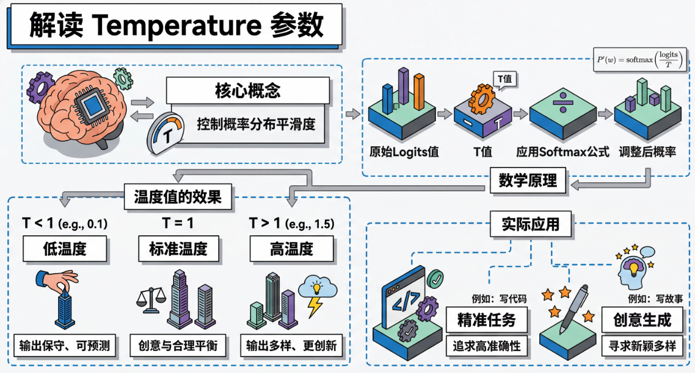
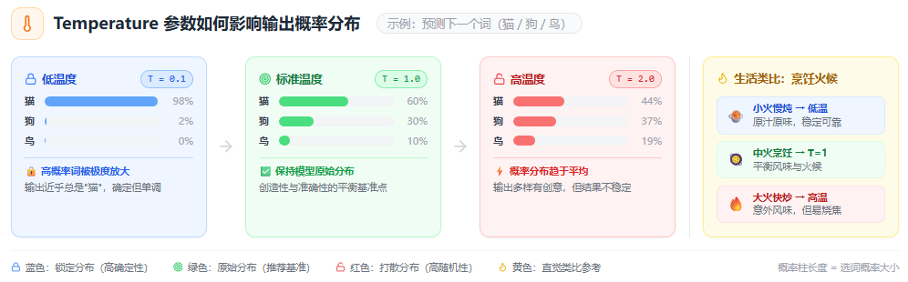
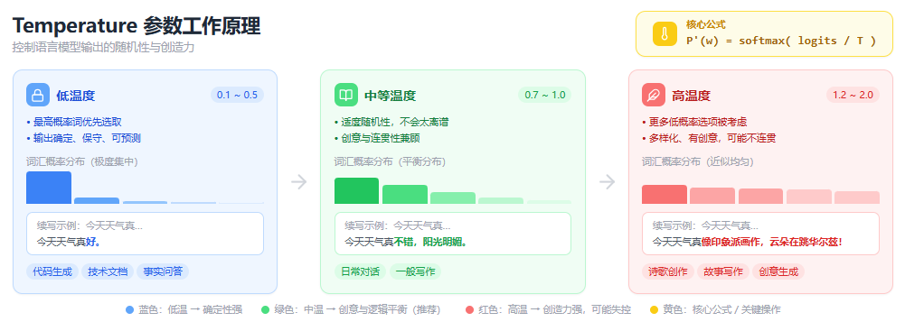

# 什么是temperature参数？

> by @Laizhuocheng

---

## 一、为什么需要temperature参数

想象一下，如果你每次问同一个问题，AI都给出完全相同的答案，这会显得很机械和死板。但在某些场景下，比如写代码或做数学题，我们又希望AI给出最准确、最可靠的答案。这就产生了一个矛盾：**我们需要AI既要有创造性，又要保持准确性**。

temperature参数就是为了解决这个矛盾而设计的。它让我们能够根据不同的使用场景，灵活地调整AI的行为模式：

- **低温度**：适合需要准确性和一致性的任务（如编程、数学计算、事实问答）
- **高温度**：适合需要创造性和多样性的任务（如写故事、诗歌创作、头脑风暴）

这就像是给AI装了一个"创造力旋钮"，我们可以根据需要随时调节。

---

## 二、什么是temperature参数

temperature参数本质上是一个**控制概率分布平滑度的超参数**。要理解这一点，我们需要先了解大语言模型是如何生成文本的。

大语言模型在生成每个词时，都会计算词汇表中所有可能词的概率。假设模型要预测下一个词，它可能会给出这样的概率分布：
- "猫"：0.6
- "狗"：0.3  
- "鸟"：0.1

如果没有temperature参数，模型通常会选择概率最高的词"猫"。但这样会导致输出过于确定和重复。

**temperature的作用就是重新调整这个概率分布**：

- **当temperature = 1**：保持原始概率分布不变
- **当temperature < 1**（如0.1）：放大高概率词的优势，抑制低概率词
- **当temperature > 1**（如1.5）：让概率分布更均匀，低概率词也有机会被选中

用一个生活化的类比：temperature就像是**烹饪时的火候控制**。小火慢炖（低温度）会让食物保持原汁原味，稳定可靠；大火快炒（高温度）则会产生更多意想不到的风味组合，但也可能烧焦。

---

## 三、temperature参数如何工作

### 3.1 数学原理

temperature参数通过以下公式重新计算概率：

```
P'(w) = softmax(logits / temperature)
```

其中：
- `logits` 是模型原始的未归一化分数
- `temperature` 是温度参数
- `P'(w)` 是调整后的概率

### 3.2 不同温度值的效果

**低温度（0.1-0.5）**：
- 模型倾向于选择最可能的词
- 输出更加确定、保守、可预测
- 适合：技术文档、代码生成、事实性问答

**中等温度（0.7-1.0）**：
- 保持一定的随机性，但不会太离谱
- 输出既有创意又相对合理
- 适合：日常对话、一般性写作

**高温度（1.2-2.0）**：
- 模型会考虑更多低概率的选项
- 输出更加多样化、创造性，但也可能不连贯
- 适合：诗歌创作、故事写作、创意生成

### 3.3 实际示例

假设我们让AI续写"今天天气真"：

- **temperature=0.1**：今天天气真好。
- **temperature=0.7**：今天天气真不错，阳光明媚。
- **temperature=1.5**：今天天气真像一幅印象派画作，云朵在蓝天上跳着华尔兹！

可以看到，随着温度升高，输出变得越来越富有想象力。

---

## 四、temperature参数的优缺点

| 优点 | 缺点 |
|------|------|
| **灵活性强**：可以根据任务需求调整AI行为 | **需要调参**：不同任务需要不同的最佳温度值 |
| **控制简单**：只需调整一个参数就能显著改变输出风格 | **效果不稳定**：高温度可能导致输出质量下降 |
| **适用广泛**：几乎所有生成任务都能受益 | **缺乏精细控制**：只能整体调节，无法针对特定方面 |
| **直观易懂**：温度概念容易理解和记忆 | **与其他参数交互复杂**：与top-k、top-p等参数配合使用时效果难以预测 |

---

## 五、temperature参数的实际应用

### 5.1 编程助手
- **温度设置**：0.2-0.4
- **原因**：代码需要精确性和一致性，不能有太多"创意"
- **效果**：生成的代码更加可靠，错误率更低

### 5.2 创意写作
- **温度设置**：0.8-1.2  
- **原因**：需要新颖的表达和独特的视角
- **效果**：故事更加生动有趣，避免千篇一律

### 5.3 学术写作
- **温度设置**：0.3-0.6
- **原因**：需要在准确性和表达多样性之间平衡
- **效果**：既保持学术严谨性，又有一定的语言变化

### 5.4 头脑风暴
- **温度设置**：1.0-1.5
- **原因**：需要尽可能多的创意想法
- **效果**：产生大量不同角度的想法，便于后续筛选

---

## 六、temperature参数的发展与演进

### 6.1 当前局限性

虽然temperature参数非常有用，但它也存在一些局限性：

1. **全局调节**：无法针对不同类型的词或不同位置进行差异化调节
2. **与其他参数的冲突**：与top-k、top-p等采样策略配合使用时，效果可能不如预期
3. **缺乏语义理解**：纯粹基于概率，不考虑语义合理性

### 6.2 改进方向

研究人员正在探索更智能的温度调节方法：

- **自适应温度**：根据上下文自动调整温度值
- **局部温度控制**：对不同词汇类别使用不同的温度
- **基于内容的温度**：根据生成内容的类型动态调整

### 6.3 未来展望

未来的AI系统可能会具备更精细化的创造力控制机制，比如：

- **多维度创造力控制**：分别控制语言风格、内容创新、逻辑严密性等
- **用户偏好学习**：自动学习用户喜欢的创造力水平
- **任务感知调节**：根据具体任务自动选择最优的温度策略

temperature参数虽然简单，却是连接AI技术能力和人类创造力需求的重要桥梁。通过合理使用这个参数，我们能够更好地发挥大语言模型的潜力，让它既可靠又富有创意。

---

> by @Laizhuocheng