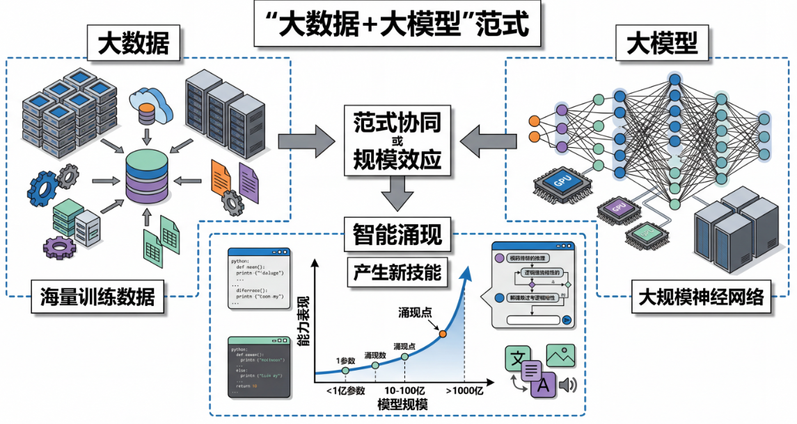
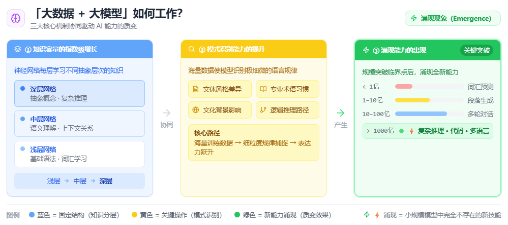

## 一、为什么需要"大数据+大模型"范式？

想象一下，你正在教一个孩子学习语言。如果只给他看几页书，他能学会多少？可能只会说几个简单的句子。但如果让他阅读整个图书馆的书籍，接触各种各样的文本——小说、新闻、百科全书、对话记录——他就能理解更复杂的概念，掌握更丰富的表达方式，甚至能够创作自己的故事。

在人工智能的发展历程中，我们遇到了同样的问题。早期的AI模型受限于计算资源和数据量，就像那个只读了几页书的孩子。但随着技术的发展，研究人员发现了一个惊人的规律：**当模型规模和训练数据同时增大时，模型的智能水平会以超乎预期的方式提升**。

这种"大数据+大模型"的组合不仅带来了性能的线性提升，更重要的是产生了**涌现能力**——模型开始展现出在小规模时完全不存在的新技能。


## 二、什么是"大数据+大模型"范式？

"大数据+大模型"范式是现代大语言模型开发的核心理念，它包含两个关键要素：

1. **海量训练数据**：使用互联网规模的文本数据集，通常包含数千亿甚至数万亿个词元（tokens）
2. **大规模神经网络**：构建参数量巨大的深度神经网络，从几亿到数千亿参数不等

这种范式的关键在于**规模的协同效应**——不是简单地增加数据或模型大小，而是两者同步扩展，从而产生质的飞跃。

### 规模定律（Scaling Laws）

研究人员发现，模型性能与三个因素呈幂律关系：
- 模型参数数量
- 训练数据量  
- 计算资源消耗

这意味着，当我们按比例增加这三个因素时，模型的损失函数（衡量预测准确性的指标）会以可预测的方式下降。

## 三、"大数据+大模型"如何工作？

### 1. 知识容量的指数级增长

更大的模型拥有更多的"记忆空间"。每一层神经网络都能存储和处理不同类型的信息：
- 浅层网络学习基础语法和词汇
- 中层网络理解语义和上下文关系
- 深层网络掌握抽象概念和复杂推理

### 2. 模式识别能力的提升

海量数据让模型能够识别极其细微的语言模式。例如：
- 不同文体的写作风格差异
- 专业领域的术语使用习惯
- 文化背景对表达方式的影响
- 逻辑推理的常见路径

### 3. 涌现能力的出现

最令人惊讶的是，当模型规模达到某个临界点时，会出现**在小模型中完全不存在的新能力**：

```
模型规模 vs 能力表现：
- < 1亿参数：基础词汇预测，简单语法
- 1-10亿参数：连贯段落生成，基础问答  
- 10-100亿参数：多轮对话，简单推理
- > 1000亿参数：复杂推理，代码生成，多语言理解
```



## 四、"大数据+大模型"的优缺点

| 优势 | 劣势 |
|------|------|
| 通用性强，单一模型可处理多种任务 | 计算资源需求巨大 |
| 涌现能力带来意想不到的智能表现 | 能源消耗和环境影响严重 |
| 零样本和少样本学习能力强 | 模型可解释性差 |
| 知识覆盖面广，接近人类专家水平 | 存在偏见和安全风险 |
| 持续扩展仍有效果，无明显上限 | 训练成本极高 |

## 五、"大数据+大模型"的实际应用

### 1. 通用AI助手
如ChatGPT、Claude等，能够回答各种领域的问题，提供创作、编程、分析等服务。

### 2. 企业知识管理
大型企业使用定制的大模型来处理内部文档、客户支持、市场分析等任务。

### 3. 科学研究加速
在生物医药、材料科学等领域，大模型帮助研究人员快速分析文献、提出假设。

### 4. 内容创作工具
从文章写作到代码生成，大模型成为创作者的强大辅助工具。

## 六、"大数据+大模型"的发展与演进

### 当前局限性
- **效率问题**：推理速度慢，成本高
- **安全问题**：可能生成有害或虚假内容
- **偏见问题**：训练数据中的偏见会被放大

### 改进方向
1. **稀疏激活**：如MoE（混合专家）架构，只激活部分参数
2. **知识蒸馏**：将大模型知识压缩到小模型中
3. **检索增强**：结合外部知识库减少幻觉
4. **高效微调**：如LoRA等技术降低适配成本

### 未来趋势
- **多模态融合**：结合文本、图像、音频等多种信息
- **具身智能**：与物理世界交互的AI系统
- **个性化模型**：为每个用户定制的专属AI
- **绿色AI**：更节能、更环保的训练和推理方法

---