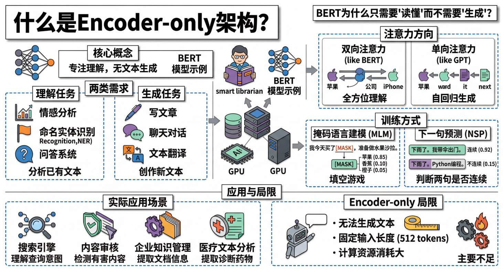
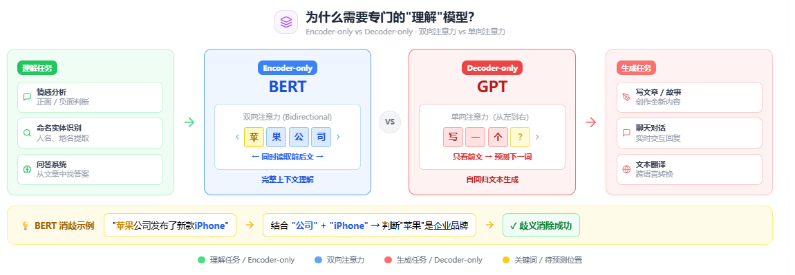
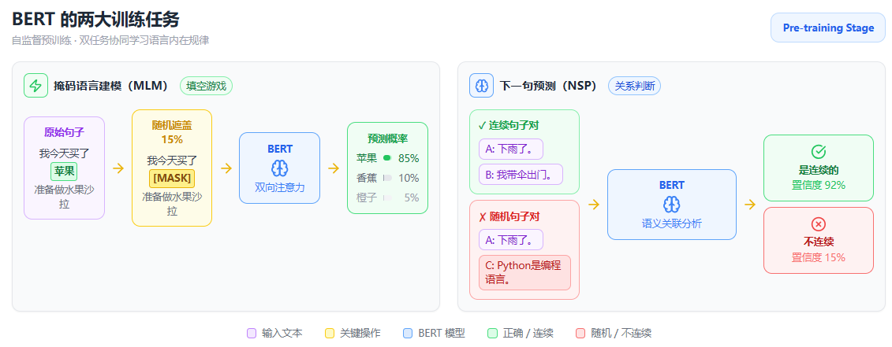

# 什么是Encoder-only架构？为什么BERT只需要"读懂"而不需要"生成"？



---

## 一、简介

Encoder-only架构是一种**只包含编码器（Encoder）组件**的神经网络结构，它专注于**理解输入文本的深层语义表示**，而不具备生成新文本的能力。最著名的Encoder-only模型就是**BERT**（Bidirectional Encoder Representations from Transformers）。

**说人话就是：** 想象你有一个超级聪明的图书管理员，她读过世界上所有的书，能准确告诉你任何概念的含义、分析文章的情感倾向、找出文本中的关键信息。但她不会自己写书或创作故事——她只负责"读懂"和"理解"。这就是Encoder-only架构的核心思想：专业化地做好"理解"这一件事。


---

## 二、为什么需要专门的"理解"模型？

在人工智能应用中，我们经常遇到两类不同的需求：

1. **理解任务**：基于已有文本进行分析、分类、问答等
   - 判断评论是正面还是负面（情感分析）
   - 找出文本中的人名、地名（命名实体识别）
   - 从文章中找出问题的答案（问答系统）

2. **生成任务**：创造新的文本内容
   - 写文章、写故事
   - 聊天对话
   - 文本翻译

Encoder-only架构专门针对第一类需求进行了优化。

### 双向注意力 vs 单向注意力

| 模型类型 | 注意力方向 | 核心优势 | 典型代表 |
|---------|-----------|---------|---------|
| Encoder-only | **双向** | 完整上下文理解 | BERT |
| Decoder-only | **单向（从左到右）** | 自回归生成 | GPT |

BERT的双向注意力让它能够同时看到一个词前后的所有信息。比如在句子"苹果公司发布了新款iPhone"中，BERT可以同时利用"公司"和"iPhone"的信息来确定"苹果"指的是企业而非水果。


---

## 三、BERT的训练方式

### 掩码语言建模（MLM）

BERT通过"填空游戏"来学习：
```
原始句子：我今天买了[苹果]，准备做水果沙拉。
遮盖后：我今天买了[MASK]，准备做水果沙拉。
BERT预测：苹果（概率0.85）、香蕉（概率0.10）、橙子（概率0.05）
```

### 下一句预测（NSP）

BERT还学习判断两个句子是否连续：
```
句子A：下雨了。
句子B：我带伞出门。
预测：是连续的（概率0.92）

句子A：下雨了。
句子C：Python是一门编程语言。
预测：不是连续的（概率0.15）
```

这种训练方式让BERT专注于理解文本的内在关系，而不是预测下一个词。

---

## 四、实际应用场景

### 1. 搜索引擎
现代搜索引擎使用BERT类模型理解用户查询的真实意图，而不仅仅是关键词匹配。

### 2. 内容审核
自动检测有害内容需要深度理解文本含义，而不是生成内容。

### 3. 企业知识管理
从大量文档中提取关键信息、建立知识图谱，这些都是理解任务。

### 4. 医疗文本分析
从病历中提取诊断信息、药物名称等，需要精确的理解能力。


---

## 五、Encoder-only的局限性

虽然Encoder-only架构在理解任务上表现出色，但它也有明显的局限：

- **无法生成文本**：只能处理输入，不能创造输出
- **固定输入长度**：通常有最大序列长度限制（如512个token）
- **计算资源消耗大**：双向注意力需要更多计算资源

因此，在需要生成能力的场景中，我们仍然需要Decoder-only或Encoder-Decoder架构。

---